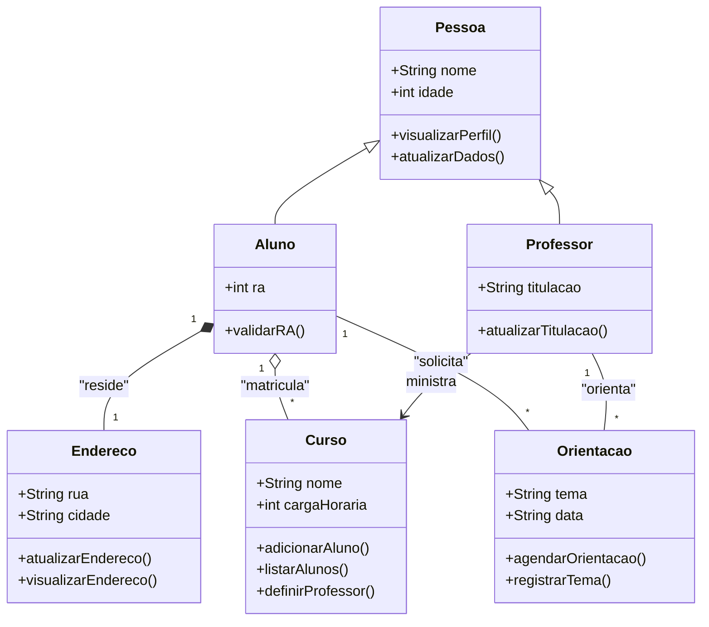

# Exemplo Visual de Diagrama de Classe (UML)

Abaixo, um exemplo de diagrama de classe simples, utilizando a sintaxe Mermaid para visualização direta no GitHub:



---

## Explicação dos Elementos e Regras Aplicadas

### 1. **Classe**
- **Pessoa, Aluno, Professor, Endereco, Curso, Orientacao**: Cada retângulo representa uma classe. O nome da classe aparece no topo.

### 2. **Atributos**
- Exemplo: `+String nome`, `+int idade`, `+int ra`, etc.
- O símbolo `+` indica **visibilidade pública**.
- O tipo do atributo é especificado após o nome (ex: `String nome`).

### 3. **Métodos**
- Exemplo: `+visualizarPerfil()`, `+atualizarDados()`, `+validarRA()`, `+atualizarTitulacao()`.
- Também usam o símbolo de visibilidade e seguem a sintaxe: `+nomeMetodo()`.
- Métodos como `validarRA()` (Aluno) e `atualizarTitulacao()` (Professor) são exemplos de comportamentos específicos dessas classes, enquanto `visualizarPerfil()` e `atualizarDados()` são herdados de Pessoa.

### 4. **Herança (Generalização)**
- `Pessoa <|-- Aluno` e `Pessoa <|-- Professor`: Indica que Aluno e Professor herdam de Pessoa (relação "é-um").
- **Observação:** No diagrama, os atributos e métodos herdados de `Pessoa` por `Aluno` e `Professor` não são repetidos nas caixas das subclasses, mas eles fazem parte dessas classes por herança.

#### Exemplo de código (Java):
```java
class Pessoa {
    public String nome;
    public int idade;
    public void visualizarPerfil() { /* ... */ }
    public void atualizarDados() { /* ... */ }
}

class Aluno extends Pessoa {
    public int ra;
    public boolean validarRA() { /* ... */ }
}

class Professor extends Pessoa {
    public String titulacao;
    public void atualizarTitulacao(String novaTitulacao) { /* ... */ }
}
```

### 5. **Associação**
- `Professor --> Curso : ministra`: Professor está associado a Curso, indicando que um professor ministra um ou mais cursos.
- `Aluno -- Orientacao : solicita` e `Professor -- Orientacao : orienta`: Indicam que a orientação é uma relação entre aluno e professor, modelada por uma classe intermediária.

### 6. **Agregação**
- `Aluno "1" o-- "*" Curso`: Aluno está agregado a Curso, ou seja, um aluno pode estar matriculado em vários cursos, mas o curso existe independentemente do aluno.

### 7. **Composição**
- `Aluno "1" *-- "1" Endereco`: Aluno possui um endereço, e o endereço só existe enquanto o aluno existir (ciclo de vida compartilhado).

### 8. **Multiplicidade**
- `Aluno "1" o-- "*" Curso`: Um aluno pode estar matriculado em vários cursos (1 para muitos).
- `Professor "1" --> "*" Curso`: Um professor pode ministrar vários cursos.
- `Aluno "1" *-- "1" Endereco`: Um aluno tem exatamente um endereço.
- `Aluno "1" -- "*" Orientacao`: Um aluno pode solicitar várias orientações.
- `Professor "1" -- "*" Orientacao`: Um professor pode orientar várias orientações.

### 9. **Visibilidade**
- `+` (público): Atributos e métodos acessíveis de fora da classe.
- (Outros símbolos como `-` para privado e `#` para protegido podem ser usados conforme necessário.)

---

## Observação sobre Associação, Agregação e Composição

> **Nota:** Em diagramas de classe simplificados, especialmente quando o ciclo de vida dos objetos não é relevante para o entendimento do sistema, **associação, agregação e composição podem ser representadas por uma linha simples** entre as classes. No entanto, a distinção formal entre esses relacionamentos é importante para documentação detalhada e para compreender corretamente as dependências e o ciclo de vida das entidades no domínio do problema.

---

## Regras Aplicadas
- **Herança:** Subclasses herdam atributos e métodos da superclasse.
- **Associação:** Indica vínculo entre classes, sem dependência de ciclo de vida.
- **Agregação:** Relação todo-parte fraca, parte pode existir sem o todo.
- **Composição:** Relação todo-parte forte, parte depende do todo para existir.
- **Multiplicidade:** Define quantas instâncias de uma classe podem se relacionar com outra.
- **Visibilidade:** Controla o acesso a atributos e métodos.
- **Classe intermediária para relações:** Relações complexas entre entidades (como orientação entre aluno e professor) devem ser modeladas por uma classe intermediária, garantindo flexibilidade e baixo acoplamento.

---

> **Dica:** Você pode editar o diagrama Mermaid acima para criar exemplos próprios ou visualizar outros cenários de modelagem! 

---

# Materiais de Estudo

## Principal

> As referências a seguir são as indicadas no plano de ensino da disciplina. Para cada uma, estão detalhados capítulos, páginas e tópicos relevantes para o estudo de diagrama de classe, modelagem orientada a objetos e engenharia de requisitos.

1. **LARMAN, Craig. Utilizando UML e padrões: uma introdução à análise e ao projeto orientados a objetos e ao desenvolvimento iterativo. 3. ed. Porto Alegre: Bookman, 2005.**
   - **Capítulo 4:** O processo unificado e iterações na modelagem de requisitos (p. 75-100)
   - **Capítulo 5:** Levantamento e análise de requisitos (p. 101-132)
   - **Capítulo 6:** Modelagem de Classes (p. 95-135)
   - **O que estudar:** Conceitos de UML, modelagem de classes, atributos, métodos, relacionamentos (associação, agregação, composição, herança), exemplos práticos de diagramas de classe.

2. **PRESSMAN, Roger S; MAXIM, Bruce R. Engenharia de Software: uma abordagem profissional. 9. ed. Porto Alegre: McGraw-Hill, 2021.**
   - **Capítulo 8:** Engenharia de requisitos (p. 213-256)
   - **Capítulo 2:** Processos de Software (modelos tradicionais e ágeis)
   - **Capítulo 8:** Modelagem de Sistema Orientado a Objetos (p. 210-250)
   - **O que estudar:** Processos de extração, análise, negociação, validação e gerenciamento de requisitos; introdução ao diagrama de classe; exemplos de aplicação em engenharia de software.

3. **MACHADO, Felipe Nery Rodrigues. Análise e gestão de requisitos de software: onde nascem os sistemas. 1. ed. São Paulo: Érica, 2011.**
   - **Capítulo 3:** Técnicas de levantamento de requisitos (p. 45-82)
   - **Capítulo 6:** Da Modelagem ao Projeto: Modelos e Ferramentas (p. 178-200)
   - **O que estudar:** Métodos de levantamento de requisitos, integração de diagramas de classe com outros diagramas UML.

4. **BEZERRA, Eduardo. Princípios de análise e projeto de sistemas com UML. 2. ed., rev. e atual. Rio de Janeiro: Campus, 2007.**
   - **Capítulo 2:** Modelagem e Engenharia de Requisitos (p. 55-90)
   - **Capítulo 3:** Modelagem de Classes e Objetos (p. 67-110)
   - **O que estudar:** Importância da modelagem de requisitos, visibilidade de atributos e métodos, exemplos de diagramas de classe para sistemas reais.

5. **DENNIS, Alan; WIXOM, Barbara Haley. Análise e projeto de sistemas. 2. ed. Rio de Janeiro: LTC, 2011.**
   - **Capítulo 5:** Modelagem de Objetos e Classes (p. 132-170)
   - **O que estudar:** Estrutura de classes em UML, técnicas para associar classes e modelar comportamentos.

## Complementar

> Referências e materiais adicionais para aprofundamento, incluindo links e indicações de capítulos/tópicos específicos.

- **COHN, Mike; SILVA, Aldir José Coelho Corrêa da. Desenvolvimento de software com Scrum: aplicando métodos ágeis com sucesso. Porto Alegre: Bookman, 2011.**
  - Capítulo 3: Requisitos ágeis e desenvolvimento iterativo (p. 47-78)
  - Capítulo 4: Integração de UML com Scrum (p. 120-150)
  - O que estudar: Como o Scrum trata os requisitos, uso de diagramas de classe em projetos ágeis.

- **MCLAUGHLIN, Brett; POLLICE, Gary; WEST, David. Use a cabeça: análise e projeto orientado ao objeto. Rio de Janeiro: Alta Books, 2007.**
  - Capítulo 2: Pensamento Orientado a Objetos
  - Capítulo 9: Desenhando Diagramas de Classe (p. 210-240)
  - O que estudar: Como desenhar diagramas de classe, análise de casos de uso e tradução para diagramas.

- **SBROCCO, José Henrique Teixeira de Carvalho; MACEDO, Paulo Cesar de. Metodologias ágeis: engenharia de software sob medida. São Paulo: Érica, 2012.**
  - Capítulo 5: Metodologias Ágeis
  - Capítulo 7: Desenhando Diagramas para Software Ágil (p. 190-220)
  - O que estudar: Flexibilidade e adaptação dos diagramas de classe em projetos ágeis.

- **IEEE Std 830-1998 – Recommended Practice for Software Requirements Specifications.**
  - Disponível em: [IEEE Xplore Digital Library](https://ieeexplore.ieee.org/document/720574)
  - O que estudar: Padrões para a especificação de requisitos de software.

- **BABOK (Business Analysis Body of Knowledge). Guia para análise de negócios. IIBA.**
  - Disponível em: [International Institute of Business Analysis (IIBA)](https://www.iiba.org/babok-guide/)
  - O que estudar: Framework para análise e engenharia de requisitos.

- **SOMMERVILLE, Ian. Engenharia de Software.**
  - Capítulo 4: Engenharia de Requisitos (p. 85–122)
  - Disponível em: [PDF UFU](https://www.facom.ufu.br/~william/Disciplinas%202018-2/BSI-GSI030-EngenhariaSoftware/Livro/engenhariaSoftwareSommerville.pdf)

- **Engenharia de Software Moderna**
  - Capítulo 3: Requisitos
  - Disponível em: [https://engsoftmoderna.info/cap3.html](https://engsoftmoderna.info/cap3.html)

- **Princípios de Análise e Projeto de Sistemas com UML - Eduardo Bezerra**
  - Capítulo 5: Modelagem de Classes de Análise
  - Disponível em: [PDF Tecgraf PUC-Rio](https://www.tecgraf.puc-rio.br/ftp_pub/lfm/EduardoBezerra-PrincipiosAnaliseProjetoSistemasComUML-2aEd.pdf)

- **Artigo: Sommerville, Ian. "Requirements Engineering: A Roadmap".**
  - Disponível em: [Portal ACM Digital Library](https://dl.acm.org/doi/10.1145/336512.336523)
  - O que estudar: Visão geral sobre engenharia de requisitos e tendências futuras.

- **Nielsen, Jakob. Usability Engineering. Morgan Kaufmann, 1994.**
  - Capítulo 3: Métodos de levantamento de requisitos e testes de usabilidade.
  - Disponível em: [Google Books](https://books.google.com/books?id=4-dQAAAAMAAJ)

- **Artigo: Boehm, Barry. "Software Engineering Economics".**
  - Disponível em: [IEEE Xplore Digital Library](https://ieeexplore.ieee.org/document/1623664)
  - O que estudar: Impacto de requisitos mal definidos no custo do software.

--- 