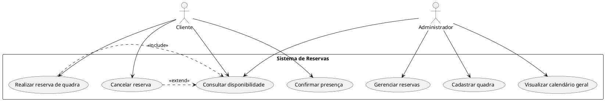

# Diagrama de Casos de Uso

## 📌 O que é?

O **Diagrama de Casos de Uso** (ou *Use Case Diagram*) é um tipo de diagrama da UML (Unified Modeling Language) que descreve as funcionalidades do sistema do ponto de vista dos usuários (atores). Ele ajuda a entender *o que* o sistema deve fazer sem se preocupar com *como* isso será feito.

---

## 🎯 Objetivos

- Representar graficamente as funcionalidades do sistema.
- Identificar os atores que interagem com o sistema.
- Especificar o relacionamento entre atores e casos de uso.
- Ajudar na comunicação entre desenvolvedores e usuários.

---

## 🧩 Elementos do Diagrama

| Elemento         | Símbolo     | Descrição                                                                 |
|------------------|-------------|---------------------------------------------------------------------------|
| **Ator**         | Boneco      | Representa o usuário ou sistema externo que interage com o sistema.      |
| **Caso de Uso**  | Elipse      | Representa uma funcionalidade ou serviço oferecido pelo sistema.         |
| **Sistema**      | Retângulo   | Representa o escopo do sistema e contém os casos de uso.                 |
| **Associação**   | Linha reta  | Conecta ator ao caso de uso com o qual interage.                         |
| **Include**      | Linha tracejada com `<<include>>` | Indica que um caso de uso sempre inclui outro.     |
| **Extend**       | Linha tracejada com `<<extend>>`  | Indica que um caso de uso pode estender outro.     |

---

## 📘 Exemplo Textual

### Sistema de Reservas de Quadras Esportivas

#### 🎭 Atores:
- **Cliente**
- **Administrador**

#### ✅ Casos de uso:
- Realizar reserva de quadra
- Cancelar reserva
- Consultar disponibilidade
- Confirmar presença
- Gerenciar reservas
- Cadastrar quadra
- Visualizar calendário geral

#### 🔗 Relacionamentos:
- O cliente pode realizar, cancelar e consultar reservas.
- O administrador pode consultar disponibilidade, gerenciar reservas e cadastrar quadras.
- "Realizar reserva" inclui "Consultar disponibilidade".
- "Cancelar reserva" pode estender "Consultar disponibilidade".

---

## 🌐 Diagrama em PlantUML

Para visualizar o diagrama, você pode usar uma extensão no VS Code como **PlantUML** ou sites como [PlantUML Online Server](https://www.plantuml.com/plantuml).

📝 Observações
Use esse diagrama para comunicar as funcionalidades com clientes, professores ou colegas de equipe.

Pode ser usado no início do projeto, durante o levantamento de requisitos.

Ideal para documentar sistemas de forma simples e compreensível.

📎 Dica
Sempre comece o diagrama identificando os atores principais e os serviços essenciais que o sistema precisa oferecer. A partir disso, vá refinando os casos de uso e relacionamentos.

css
Copiar
Editar

