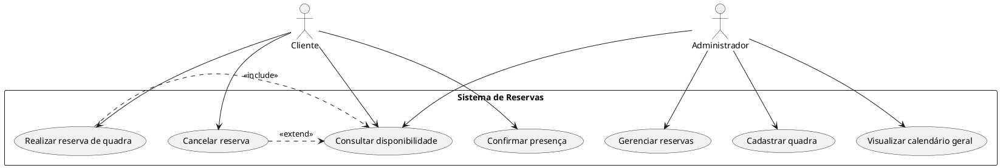

# Diagrama de Casos de Uso

## 📌 O que é?

O **Diagrama de Casos de Uso** (ou *Use Case Diagram*) é um tipo de diagrama da UML (Unified Modeling Language) que descreve as funcionalidades do sistema do ponto de vista dos usuários (atores). Ele ajuda a entender *o que* o sistema deve fazer sem se preocupar com *como* isso será feito.

---

## 🎯 Objetivos

- Representar graficamente as funcionalidades do sistema.
- Identificar os atores que interagem com o sistema.
- Especificar o relacionamento entre atores e casos de uso.
- Ajudar na comunicação entre desenvolvedores e usuários.

---

## 🧩 Elementos do Diagrama

| Elemento         | Símbolo     | Descrição                                                                 |
|------------------|-------------|---------------------------------------------------------------------------|
| **Ator**         | Boneco      | Representa o usuário ou sistema externo que interage com o sistema.      |
| **Caso de Uso**  | Elipse      | Representa uma funcionalidade ou serviço oferecido pelo sistema.         |
| **Sistema**      | Retângulo   | Representa o escopo do sistema e contém os casos de uso.                 |
| **Associação**   | Linha reta  | Conecta ator ao caso de uso com o qual interage.                         |
| **Include**      | Linha tracejada com `<<include>>` | Indica que um caso de uso sempre inclui outro.     |
| **Extend**       | Linha tracejada com `<<extend>>`  | Indica que um caso de uso pode estender outro.     |

### Atores
Representam entidades externas que interagem com o sistema (usuários, dispositivos, outros sistemas).

### Casos de Uso
Ações ou serviços oferecidos pelo sistema. Representam funcionalidades que o sistema executa em resposta à interação com um ator.

### Relacionamentos
- **Associação**: conexão entre um ator e um caso de uso.
- **Inclusão (`<<include>>`)**: um caso de uso inclui o comportamento de outro.
- **Extensão (`<<extend>>`)**: um caso de uso estende o comportamento de outro em situações específicas.
- **Generalização**: relacionamento entre atores ou entre casos de uso com comportamentos similares.
---

## 📘 Exemplo Textual

### Sistema de Reservas de Quadras Esportivas

#### 🎭 Atores:
- **Cliente**
- **Administrador**

#### ✅ Casos de uso:
- Realizar reserva de quadra
- Cancelar reserva
- Consultar disponibilidade
- Confirmar presença
- Gerenciar reservas
- Cadastrar quadra
- Visualizar calendário geral

#### 🔗 Relacionamentos:
- O cliente pode realizar, cancelar e consultar reservas.
- O administrador pode consultar disponibilidade, gerenciar reservas e cadastrar quadras.
- "Realizar reserva" inclui "Consultar disponibilidade".
- "Cancelar reserva" pode estender "Consultar disponibilidade".

---

## 🌐 Diagrama em PlantUML

Para visualizar o diagrama, você pode usar uma extensão no VS Code como **PlantUML** ou sites como [PlantUML Online Server](https://www.plantuml.com/plantuml).

### 📝 Observações
Use esse diagrama para comunicar as funcionalidades com clientes, professores ou colegas de equipe.

Pode ser usado no início do projeto, durante o levantamento de requisitos.

Ideal para documentar sistemas de forma simples e compreensível.

### 📎 Dica
Sempre comece o diagrama identificando os atores principais e os serviços essenciais que o sistema precisa oferecer. A partir disso, vá refinando os casos de uso e relacionamentos.

## Boas Práticas
- Nomear claramente os casos de uso com verbos no infinitivo;
- Manter simplicidade e foco no comportamento externo do sistema;
- Utilizar relacionamentos com moderação para não poluir o diagrama.

## Ferramentas Gratuitas para Criação de Diagramas de Casos de Uso

### Ferramentas Online
- [Draw.io (diagrams.net)](https://www.diagrams.net/): editor gratuito e online de diagramas com suporte a UML.
- [Lucidchart (versão gratuita limitada)](https://www.lucidchart.com/): ferramenta colaborativa online com suporte a diagramas UML.
- [Creately](https://www.creately.com/): ferramenta online com suporte a UML (versão gratuita limitada).
- [PlantUML Online Demo](http://www.plantuml.com/plantuml/uml/): para gerar diagramas a partir de texto com sintaxe PlantUML.

### Ferramentas para Instalação
- [StarUML](https://staruml.io/): ferramenta poderosa para modelagem UML (versão gratuita com limitações).
- [UMLet](https://www.umlet.com/): leve e simples, ideal para diagramas rápidos.
- [Modelio](https://www.modelio.org/): software livre com suporte completo a UML.
- [PlantUML](https://plantuml.com/): gera diagramas a partir de texto, pode ser integrado a IDEs e editores de texto como VS Code.

## Material de Estudo

### Base Bibliográfica Oficial
- **LARMAN, Craig.** *Utilizando UML e padrões: uma introdução à análise e ao projeto orientados a objetos e ao desenvolvimento iterativo.* 3. ed. Porto Alegre: Bookman, 2005.
- **PRESSMAN, Roger S; MAXIM, Bruce R.** *Engenharia de Software: uma abordagem profissional.* 9. ed. Porto Alegre: McGraw-Hill, 2021.
- **MACHADO, Felipe Nery Rodrigues.** *Análise e gestão de requisitos de software: onde nascem os sistemas.* São Paulo: Érica, 2011.

### Bibliografia Complementar
- **BEZERRA, Eduardo.** *Princípios de análise e projeto de sistemas com UML.* 2. ed. Rio de Janeiro: Campus, 2007.
- **COHN, Mike; SILVA, Aldir José Coelho Corrêa da.** *Desenvolvimento de software com Scrum.* Porto Alegre: Bookman, 2011.
- **DENNIS, Alan; WIXOM, Barbara Haley.** *Análise e projeto de sistemas.* 2. ed. Rio de Janeiro: LTC, 2011.
- **MCLAUGHLIN, Brett; POLLICE, Gary; WEST, David.** *Use a cabeça: análise e projeto orientado ao objeto.* Rio de Janeiro: Alta Books, 2007.
- **SBROCCO, José Henrique Teixeira de Carvalho; MACEDO, Paulo Cesar de.** *Metodologias ágeis: engenharia de software sob medida.* São Paulo: Érica, 2012.

### Materiais Complementares Online
- Site oficial do PlantUML: [https://plantuml.com/](https://plantuml.com/)
- Repositório de exemplos do PlantUML: [https://github.com/plantuml/plantuml](https://github.com/plantuml/plantuml)

