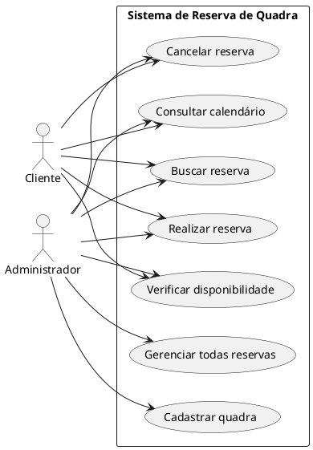
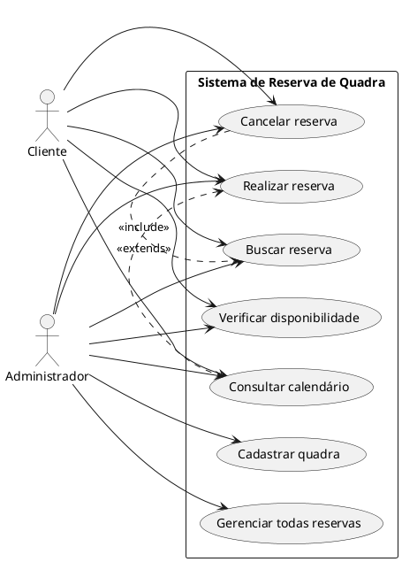
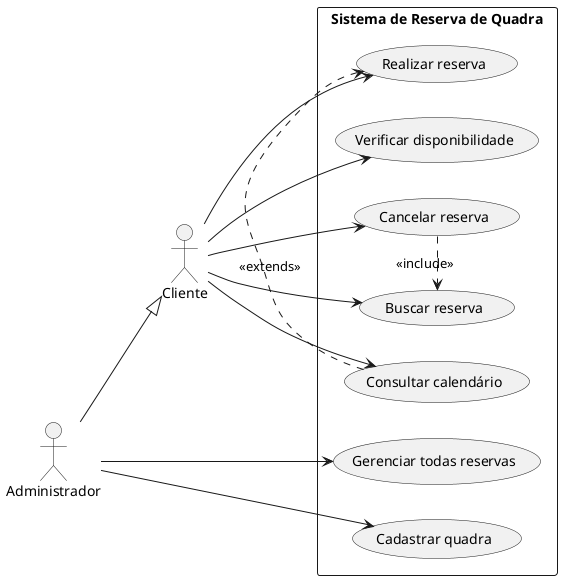

# 📘 Diagrama de Casos de Uso – Guia Completo

## 📌 O que é?

O **Diagrama de Casos de Uso** (*Use Case Diagram*) é um tipo de diagrama da UML (Unified Modeling Language) que descreve as funcionalidades de um sistema sob a perspectiva dos usuários (atores). Seu foco está **no comportamento externo do sistema** – ou seja, **o que o sistema faz**, não como ele faz.

---

## 🎯 Objetivos

- Representar graficamente as funcionalidades do sistema;
- Identificar os atores (usuários/sistemas externos);
- Especificar o relacionamento entre atores e funcionalidades (casos de uso);
- Facilitar a comunicação entre desenvolvedores, clientes e stakeholders.

### 📝 Observações
Use esse diagrama para comunicar as funcionalidades com clientes, professores ou colegas de equipe.  
Pode ser usado no início do projeto, durante o levantamento de requisitos.  
Ideal para documentar sistemas de forma simples e compreensível.  

### 📎 Dica
Sempre comece o diagrama identificando os atores principais e os serviços essenciais que o sistema precisa oferecer. A partir disso, vá refinando os casos de uso e relacionamentos.

## Boas Práticas
- Nomear claramente os casos de uso com verbos no infinitivo;
- Manter simplicidade e foco no comportamento externo do sistema;
- Utilizar relacionamentos com moderação para não poluir o diagrama.

## Ferramentas Gratuitas para Criação de Diagramas de Casos de Uso

### Ferramentas Online
- [Draw.io (diagrams.net)](https://www.diagrams.net/): editor gratuito e online de diagramas com suporte a UML.
- [Lucidchart (versão gratuita limitada)](https://www.lucidchart.com/): ferramenta colaborativa online com suporte a diagramas UML.
- [Creately](https://www.creately.com/): ferramenta online com suporte a UML (versão gratuita limitada).
- [PlantUML Online Demo](http://www.plantuml.com/plantuml/uml/): para gerar diagramas a partir de texto com sintaxe PlantUML.

### Ferramentas para Instalação
- [StarUML](https://staruml.io/): ferramenta poderosa para modelagem UML (versão gratuita com limitações).
- [UMLet](https://www.umlet.com/): leve e simples, ideal para diagramas rápidos.
- [Modelio](https://www.modelio.org/): software livre com suporte completo a UML.
- [PlantUML](https://plantuml.com/): gera diagramas a partir de texto, pode ser integrado a IDEs e editores de texto como VS Code.

---

## 🧩 Elementos do Diagrama

| Elemento         | Símbolo     | Descrição                                                                 |
|------------------|-------------|---------------------------------------------------------------------------|
| **Ator**         | Boneco      | Entidade externa que interage com o sistema (usuário, sistema, dispositivo).      |
| **Caso de Uso**  | Elipse      | Funcionalidade ou serviço oferecido pelo sistema.                         |
| **Sistema**      | Retângulo   | Representa o escopo do sistema e contém os casos de uso.                 |
| **Associação**   | Linha reta  | Conecta um ator ao caso de uso com o qual interage.                      |
| **Include**      | Linha tracejada com `<<include>>` | Um caso de uso inclui sempre o comportamento de outro.     |
| **Extend**       | Linha tracejada com `<<extend>>`  | Um caso de uso pode opcionalmente estender outro.     |
| **Generalização**| Linha com seta aberta | Relaciona atores ou casos de uso com comportamentos similares. |

---

## 🎭 Atores

Entidades que interagem com o sistema. Podem ser:
- Pessoas (usuários);
- Dispositivos;
- Sistemas externos.

---
## 📘 Exemplo Textual

### Sistema de Reservas de Quadras Esportivas

#### 🎭 Atores:
- **Cliente**
- **Administrador**

#### ✅ Casos de uso:
- Consultar calendário  
- Buscar reserva  
- Realizar reserva  
- Verificar disponibilidade  
- Cancelar reserva
- Gerenciar todas reservas
- Cadastrar quadra  

## 🌐 Diagrama em PlantUML

Para visualizar o diagrama, você pode usar uma extensão no VS Code como **PlantUML** ou sites como [PlantUML Online Server](https://www.plantuml.com/plantuml).

### 🛠 Como usar PlantUML no VS Code

1. **Instale o Java**
   - Baixe e instale o JDK: [https://www.oracle.com/java/technologies/javase-jdk11-downloads.html](https://www.oracle.com/java/technologies/javase-jdk11-downloads.html)

2. **Instale a extensão PlantUML**
   - No VS Code, acesse a aba de extensões (`Ctrl+Shift+X`)
   - Procure por `PlantUML` (autor: *jebbs*) e instale.

3. **Crie um arquivo `.puml`**
   - Exemplo: `reserva_quadras.puml`

4. **Visualize o diagrama**
   - Clique com o botão direito no arquivo e selecione **Preview Current Diagram** ou use o atalho `Alt+D`.

---

### 💡 Explicação das palavras-chave do PlantUML

| Palavra-chave                          | Descrição                                                                 |
|----------------------------------------|---------------------------------------------------------------------------|
| `@startuml` / `@enduml`                | Delimitam o início e o fim do diagrama                                   |
| `left to right direction`              | Define que o diagrama será desenhado na horizontal                        |
| `actor "Nome" as Identificador`        | Cria um ator (usuário do sistema), com nome visível e identificador       |
| `rectangle "Nome"`                     | Agrupa os casos de uso sob o nome do sistema                              |
| `usecase "Ação" as Identificador`      | Define um caso de uso (ação realizada pelo ator no sistema)               |
| `Ator --> CasoDeUso`                   | Conecta um ator ao caso de uso que ele executa (relação de interação)     |

## 🔗 Relacionamentos

- **Associação**: ator interage com um caso de uso.
- **\<\<include\>\>**: um caso de uso sempre **invoca** outro. Ex: "Realizar Reserva" sempre inclui "Verificar Disponibilidade".
- **\<\<extend\>\>**: um caso de uso pode **opcionalmente** estender outro. Ex: "Cacelar Reserva" pode estender "Verificar disponibilidade".
- **Generalização (herança)**: usada quando há **atores semelhantes** ou **casos de uso com comportamento comum**.

#### 🔗 Relacionamentos:
- O cliente pode realizar, cancelar e consultar reservas.
- O administrador pode consultar disponibilidade, gerenciar reservas e cadastrar quadras.
- "Realizar reserva" inclui "Consultar disponibilidade".
- "Cancelar reserva" pode estender "Consultar disponibilidade".

---

## 📚 Exemplo 02 – Relacionamento \<\<include\>\> vs \<\<extend\>\>
📌 Situação:
O usuário pode realizar uma reserva, mas isso sempre exige verificação de disponibilidade (<<include>>).  
Se for uma reserva para horário fora do expediente, é necessário solicitar aprovação (<<extend>>).  

### 🧠 Explicação:
  - \<\<include\>\>: "Verificar disponibilidade" sempre será executado quando o usuário quiser reservar.  
  - \<\<extend\>\>: "Solicitar aprovação extra-horário" só acontece se o horário estiver fora do expediente padrão.

---

## 🧬 Exemplo – Herança entre Atores no Sistema de Quadras
📌 Situação:
No sistema há vários tipos de usuários, como "Cliente" e "Administrador". Administrador herda de "Cliente", que tem funcionalidades básicas como "Realizar reserva".
Mas somente o Administrador têm casos de uso exclusivos, como "Gerenciar Reserva".

## Atividade 
- Identifique mais 2 casos de uso para cada autor.
- Identifique mais 2 extends e 2 includes.
- Defina mais um ator diferente dos demais e defina a hierarquia.
- Aplique o que aprendeu no estudo de caso - em grupo.
- Coloque e/ou melhore o seu diário de aula.
- Faça o seu estudo de caso individual.

## Material de Estudo

### Base Bibliográfica Oficial
- **LARMAN, Craig.** *Utilizando UML e padrões: uma introdução à análise e ao projeto orientados a objetos e ao desenvolvimento iterativo.* 3. ed. Porto Alegre: Bookman, 2005.
- **PRESSMAN, Roger S; MAXIM, Bruce R.** *Engenharia de Software: uma abordagem profissional.* 9. ed. Porto Alegre: McGraw-Hill, 2021.
- **MACHADO, Felipe Nery Rodrigues.** *Análise e gestão de requisitos de software: onde nascem os sistemas.* São Paulo: Érica, 2011.

### Bibliografia Complementar
- **BEZERRA, Eduardo.** *Princípios de análise e projeto de sistemas com UML.* 2. ed. Rio de Janeiro: Campus, 2007.
- **COHN, Mike; SILVA, Aldir José Coelho Corrêa da.** *Desenvolvimento de software com Scrum.* Porto Alegre: Bookman, 2011.
- **DENNIS, Alan; WIXOM, Barbara Haley.** *Análise e projeto de sistemas.* 2. ed. Rio de Janeiro: LTC, 2011.
- **MCLAUGHLIN, Brett; POLLICE, Gary; WEST, David.** *Use a cabeça: análise e projeto orientado ao objeto.* Rio de Janeiro: Alta Books, 2007.
- **SBROCCO, José Henrique Teixeira de Carvalho; MACEDO, Paulo Cesar de.** *Metodologias ágeis: engenharia de software sob medida.* São Paulo: Érica, 2012.

### Materiais Complementares Online
- Site oficial do PlantUML: [https://plantuml.com/](https://plantuml.com/)
- Repositório de exemplos do PlantUML: [https://github.com/plantuml/plantuml](https://github.com/plantuml/plantuml)

