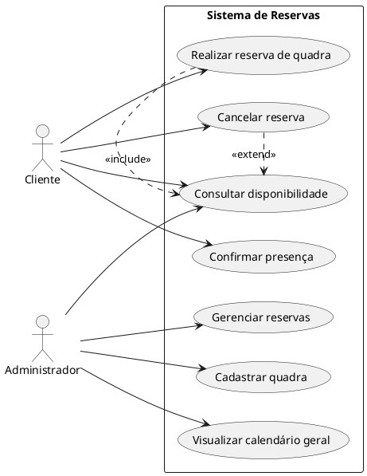
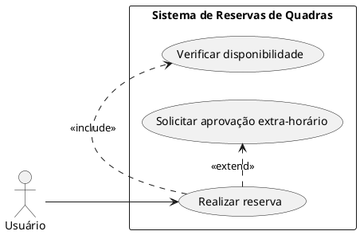
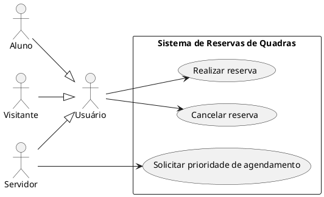

# 📘 Diagrama de Casos de Uso – Guia Completo

## 📌 O que é?

O **Diagrama de Casos de Uso** (*Use Case Diagram*) é um tipo de diagrama da UML (Unified Modeling Language) que descreve as funcionalidades de um sistema sob a perspectiva dos usuários (atores). Seu foco está **no comportamento externo do sistema** – ou seja, **o que o sistema faz**, não como ele faz.

---

## 🎯 Objetivos

- Representar graficamente as funcionalidades do sistema;
- Identificar os atores (usuários/sistemas externos);
- Especificar o relacionamento entre atores e funcionalidades (casos de uso);
- Facilitar a comunicação entre desenvolvedores, clientes e stakeholders.

---

## 🧩 Elementos do Diagrama

| Elemento         | Símbolo     | Descrição                                                                 |
|------------------|-------------|---------------------------------------------------------------------------|
| **Ator**         | Boneco      | Entidade externa que interage com o sistema (usuário, sistema, dispositivo).      |
| **Caso de Uso**  | Elipse      | Funcionalidade ou serviço oferecido pelo sistema.                         |
| **Sistema**      | Retângulo   | Representa o escopo do sistema e contém os casos de uso.                 |
| **Associação**   | Linha reta  | Conecta um ator ao caso de uso com o qual interage.                      |
| **Include**      | Linha tracejada com `<<include>>` | Um caso de uso inclui sempre o comportamento de outro.     |
| **Extend**       | Linha tracejada com `<<extend>>`  | Um caso de uso pode opcionalmente estender outro.     |
| **Generalização**| Linha com seta aberta | Relaciona atores ou casos de uso com comportamentos similares. |

---

## 🎭 Atores

Entidades que interagem com o sistema. Podem ser:
- Pessoas (usuários);
- Dispositivos;
- Sistemas externos.

---

## ✅ Casos de Uso

São **funcionalidades observáveis** do sistema. Sempre devem ser nomeados com **verbos no infinitivo**, como:  
🔹 "Consultar saldo"  
🔹 "Emitir relatório"  
🔹 "Realizar reserva"  

---

## 🔗 Relacionamentos

- **Associação**: ator interage com um caso de uso.
- **\<\<include\>\>**: um caso de uso sempre **invoca** outro. Ex: "Emitir boleto" sempre inclui "Calcular valor final".
- **\<\<extend\>\>**: um caso de uso pode **opcionalmente** estender outro. Ex: "Fazer login" pode estender "Autenticar por biometria".
- **Generalização (herança)**: usada quando há **atores semelhantes** ou **casos de uso com comportamento comum**.

---

## 🌐 Exemplo 1 – Diagrama Simples: Sistema de Reservas de Quadras

## 📚 Exemplo 2 – <<include>> vs <<extend>>
📌 Situação:
O usuário pode realizar uma reserva, mas isso sempre exige verificação de disponibilidade (<<include>>).  
Se for uma reserva para horário fora do expediente, é necessário solicitar aprovação (<<extend>>).  

### 🧠 Explicação:
  - <<include>>: "Verificar disponibilidade" sempre será executado quando o usuário quiser reservar.  
  - <<extend>>: "Solicitar aprovação extra-horário" só acontece se o horário estiver fora do expediente padrão.

## 🧬 Exemplo 3 – Herança entre Atores no Sistema de Quadras
📌 Situação:
No sistema há vários tipos de usuários, como "Aluno", "Servidor" e "Visitante". Todos herdam de "Usuário", que tem funcionalidades básicas como "Realizar reserva".
Mas alguns têm casos de uso exclusivos, como "Prioridade de agendamento" para servidores.

### 🧠 Explicação:
Todos os atores especializados herdam os direitos e interações do ator "Usuário".  
Somente "Servidor" pode realizar ações específicas como solicitar prioridade de agendamento, o que reflete políticas institucionais, por exemplo.  

