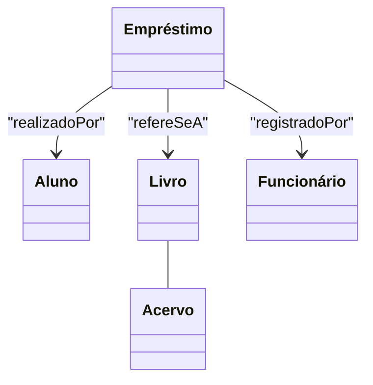
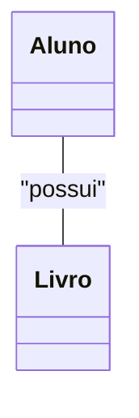
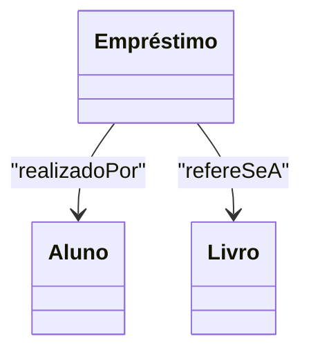
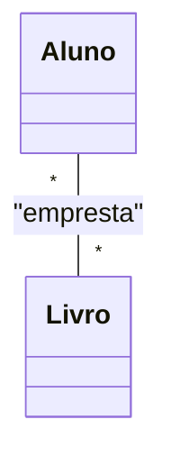
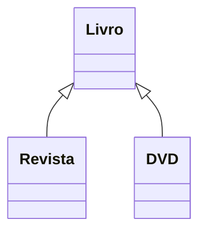
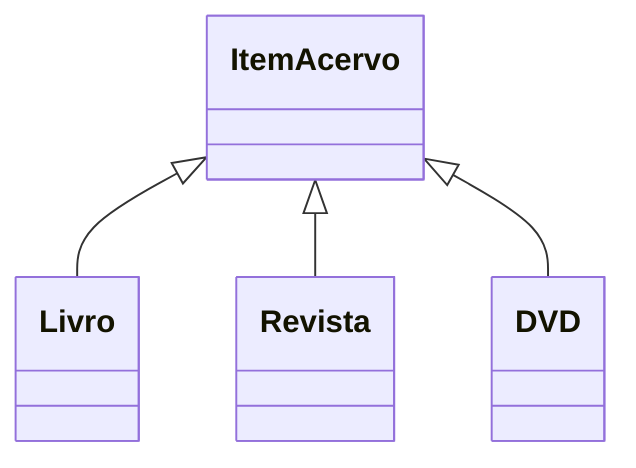
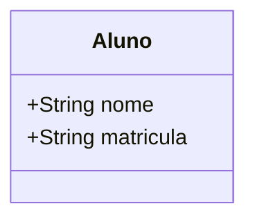
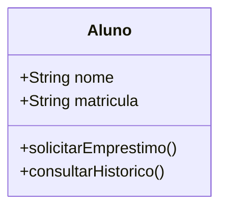
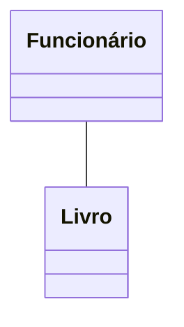
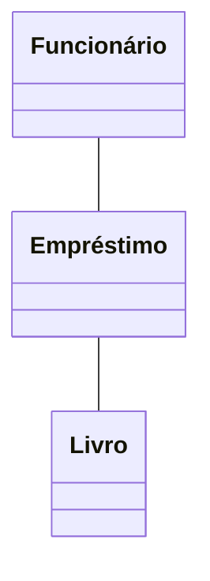

# Prática de Modelagem: Desafios e Boas Práticas

---

## 1. Identificação de Entidades e Seus Papéis

> Metodologias para extrair classes, atributos e métodos a partir de requisitos funcionais e regras de negócio.

### Exemplo Contextual

**Domínio:** Sistema de Biblioteca Universitária

**Requisito:** "O aluno pode realizar empréstimos de livros. O funcionário registra a devolução. Cada livro pertence a um acervo."

**Extração de Entidades:**
- **Aluno** (quem realiza empréstimos)
- **Funcionário** (quem registra devolução)
- **Livro** (objeto do empréstimo)
- **Acervo** (coleção de livros)
- **Empréstimo** (evento/processo)

**Atributos e Métodos sugeridos:**
- Aluno: matrícula, nome
- Funcionário: id, nome
- Livro: título, autor, código
- Acervo: nome, localização
- Empréstimo: data, status

**Visualização (Mermaid):**

---

## 2. Granularidade da Modelagem

> Decisão sobre o nível de detalhe apropriado para as classes e atributos, evitando excesso ou falta de informação.

### Exemplo Prático

- **Excesso de granularidade (errado):**
  - Classe `Livro` com atributos: título, autor, editora, ano, número de páginas, ISBN, cor da capa, tipo de papel, peso, altura, largura, profundidade, idioma, edição, etc.
- **Falta de granularidade (errado):**
  - Classe `Livro` apenas com atributo: nome.
- **Adequado (certo):**
  - Classe `Livro` com: título, autor, código, ano, editora.

**Dica:**
> Foque nos atributos e métodos relevantes para o domínio e para as regras de negócio do sistema.

---

## 3. Análise Crítica de Modelos

> Avaliação da adequação, consistência e conformidade de Diagramas de Classe com os princípios de design e as necessidades do domínio.

### Exemplo Visual

**Modelo Incorreto:**

- **Problema:** Aluno não "possui" livros, ele realiza empréstimos. O relacionamento correto é entre Aluno e Empréstimo, e Empréstimo e Livro.

**Modelo Corrigido:**

**Cuidados:**
- Verifique se os relacionamentos refletem a realidade do domínio.
- Evite ligações diretas que não existem no mundo real.

---

## 4. Análise Crítica de Modelos

> Avaliação da adequação, consistência e conformidade de Diagramas de Classe com os princípios de design e as necessidades do domínio.

### Exemplo Visual

**Modelo Incorreto:**

- **Problema:** Apesar do nomenclatura estar correta, o empréstimo possui atributos própriots como data de empréstimo em que não é possível representar somente com a associação.

**Modelo Corrigido:**

**Cuidados:**
- Verifique se os relacionamentos refletem a realidade do domínio.
- Evite ligações diretas que não existem no mundo real.

---

## 5. Antipadrões de Modelagem

> Identificação e discussão de práticas de modelagem que levam a designs subótimos ou problemáticos (ex: herança mal aplicada, classes anêmicas).

### Exemplos de Antipadrões

#### a) **Herança Mal Aplicada**

**Errado:**

- **Problema:** DVD não é um tipo de Livro. O correto seria uma superclasse `ItemAcervo`.

**Certo:**

#### b) **Classe Anêmica**

**Errado:**

- **Problema:** Classe só tem dados, sem métodos. Não representa comportamento.

**Certo:**

#### c) **Relacionamentos Desnecessários**

**Errado:**

- **Problema:** Funcionário não se relaciona diretamente com Livro, mas sim com Empréstimo.

**Certo:**

---

# Materiais de Estudo

## Principal

> Referências do plano de ensino, detalhadas para estudo de desafios e práticas de modelagem:

1. **LARMAN, Craig. Utilizando UML e padrões. 3. ed. Bookman, 2005.**
   - Capítulo 6: Modelagem de Classes (p. 95-135)
   - Capítulo 9: Padrões de Projeto e Antipadrões (p. 210-250)
   - O que estudar: Identificação de entidades, boas práticas de modelagem, exemplos de antipadrões.

2. **PRESSMAN, Roger S; MAXIM, Bruce R. Engenharia de Software. 9. ed. McGraw-Hill, 2021.**
   - Capítulo 8: Modelagem de Sistema Orientado a Objetos (p. 210-250)
   - O que estudar: Análise crítica de modelos, exemplos de erros comuns e boas práticas.

3. **BEZERRA, Eduardo. Princípios de análise e projeto de sistemas com UML. 2. ed. Campus, 2007.**
   - Capítulo 3: Modelagem de Classes e Objetos (p. 67-110)
   - O que estudar: Exemplos de modelagem correta e incorreta, análise de granularidade.

## Complementar

> Materiais adicionais para aprofundamento, com acesso e tópicos detalhados:

- **Engenharia de Software Moderna**
  - Capítulo 3: Requisitos
  - Disponível em: [https://engsoftmoderna.info/cap3.html](https://engsoftmoderna.info/cap3.html)
  - O que estudar: Exemplos de modelagem, análise de requisitos e identificação de entidades.

- **Princípios de Análise e Projeto de Sistemas com UML - Eduardo Bezerra**
  - Capítulo 5: Modelagem de Classes de Análise
  - Disponível em: [PDF Tecgraf PUC-Rio](https://www.tecgraf.puc-rio.br/ftp_pub/lfm/EduardoBezerra-PrincipiosAnaliseProjetoSistemasComUML-2aEd.pdf)
  - O que estudar: Exemplos visuais de modelagem, antipadrões e boas práticas.

- **Artigo: Sommerville, Ian. "Requirements Engineering: A Roadmap".**
  - Disponível em: [Portal ACM Digital Library](https://dl.acm.org/doi/10.1145/336512.336523)
  - O que estudar: Tendências e desafios em modelagem e requisitos.

--- 