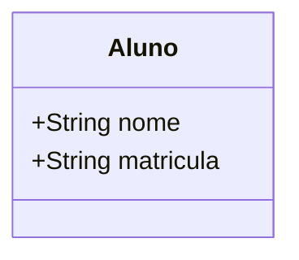
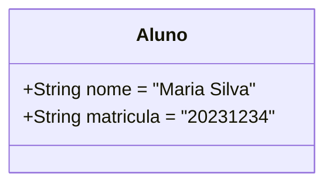
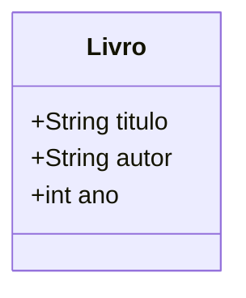
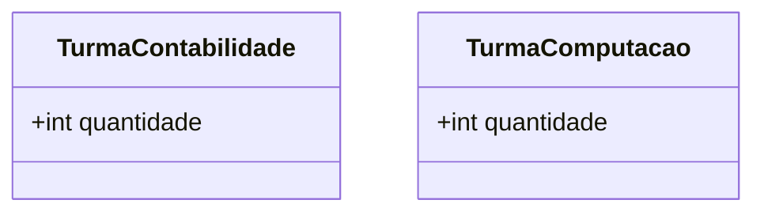
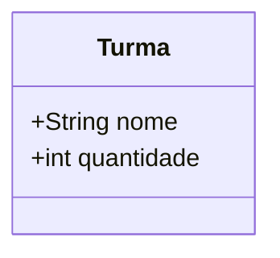
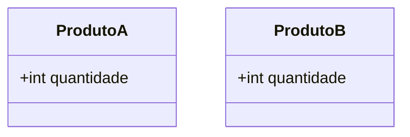
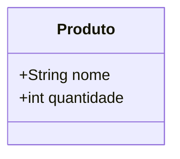
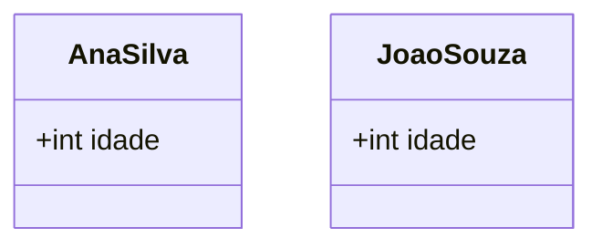
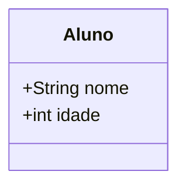

# Adequação de Classes e Atributos: Estrutura vs. Instância

---

## 1. O que é um Diagrama de Classes?

Um **diagrama de classes** representa a **estrutura** de um sistema orientado a objetos. Ele mostra:
- Quais são as classes (tipos de objetos)
- Quais atributos (características) e métodos (comportamentos) cada classe possui
- Como as classes se relacionam entre si

> **Importante:** O diagrama de classes **não** mostra dados concretos, mas sim a **definição dos tipos** que podem existir no sistema.

---

## 2. Diferença entre Atributos e Instâncias/Valores

- **Atributo:** É uma característica genérica de uma classe, que define o tipo de informação que cada objeto daquela classe terá.
- **Instância/Valor:** É o dado concreto atribuído a um objeto específico em tempo de execução.

### Exemplo Contextualizado

**Classe:** Aluno
- **Atributos:** nome, matrícula

**Instância (objeto real):**
- nome = "Maria Silva"
- matrícula = "20231234"

> O diagrama de classes **não** mostra "Maria Silva" ou "20231234". Ele só mostra que todo Aluno tem um nome e uma matrícula.

---

## 3. Erro Comum: Confundir Atributo com Valor

### **Errado:**

- **Problema:** O diagrama está mostrando valores concretos, o que não é permitido. O correto é mostrar apenas os tipos dos atributos.

### **Certo:**

---

## 4. Exemplos de Estrutura vs. Instância

### **Estrutura (Classe):**

### **Instância (Objeto):**
- titulo = "Engenharia de Software"
- autor = "Ian Sommerville"
- ano = 2020

> O diagrama de classes **não** mostra esses valores. Ele só define que todo Livro tem um título, um autor e um ano.

---

## 5. Dicas e Cuidados

- Sempre modele **atributos genéricos** (ex: nome, dataNascimento, saldo), nunca valores concretos.
- Não coloque exemplos de dados reais no diagrama de classes.
- Use nomes de atributos que façam sentido para qualquer objeto daquela classe.
- Se quiser mostrar exemplos de dados, faça isso em uma tabela separada ou em diagramas de objetos (não de classes).

---

## 6. Resumo Visual

| Conceito         | Diagrama de Classe (estrutura)         | Exemplo de Instância (dados reais)         |
|------------------|----------------------------------------|--------------------------------------------|
| Classe           | Aluno                                  | Aluno                                     |
| Atributo         | nome: String                           | nome = "Maria Silva"                      |
| Atributo         | matricula: String                      | matricula = "20231234"                    |

---

## 7. Erros Comuns de Iniciantes: Classes para Instâncias

Um erro frequente é criar uma classe para cada instância concreta, em vez de criar uma classe genérica e usar atributos para diferenciar as instâncias.

### Exemplo 1: Turma alunos

**Errado:**

- **Problema:** Para cada nova turma seria necessário criar uma nova classe via programação.

**Certo:**

- **Explicação:** Use uma classe genérica `Turma` e diferencie as turmas pelo atributo `nome` que pode ser realizado por um usuário comum.

---

### Exemplo 2: Produtos de Estoque

**Errado:**

- **Problema:** Cada produto é uma classe. Isso não escala e dificulta a manutenção.

**Certo:**

- **Explicação:** Use uma classe genérica `Produto` e diferencie os produtos pelo atributo `nome`.

---

### Exemplo 3: Alunos de uma Turma

**Errado:**

- **Problema:** Cada aluno é uma classe. O correto é ter uma classe genérica.

**Certo:**

- **Explicação:** Instancie cada aluno com valores diferentes para os atributos.

---

## Dica Final

> Sempre modele **tipos genéricos** (classes) e use **atributos** para diferenciar as instâncias. Nunca crie uma classe para cada objeto real do mundo!

---

## 8. Materiais de Estudo

### Principal

1. **LARMAN, Craig. Utilizando UML e padrões. 3. ed. Bookman, 2005.**
   - Capítulo 6: Modelagem de Classes (p. 95-135)
   - O que estudar: Diferença entre estrutura e instância, exemplos de atributos e objetos.

2. **BEZERRA, Eduardo. Princípios de análise e projeto de sistemas com UML. 2. ed. Campus, 2007.**
   - Capítulo 3: Modelagem de Classes e Objetos (p. 67-110)
   - O que estudar: Exemplos de modelagem correta de atributos e classes.

### Complementar

- **Engenharia de Software Moderna**
  - Capítulo 3: Requisitos
  - Disponível em: [https://engsoftmoderna.info/cap3.html](https://engsoftmoderna.info/cap3.html)
  - O que estudar: Exemplos de estrutura vs. instância, dicas de modelagem.

- **Princípios de Análise e Projeto de Sistemas com UML - Eduardo Bezerra**
  - Capítulo 5: Modelagem de Classes de Análise
  - Disponível em: [PDF Tecgraf PUC-Rio](https://www.tecgraf.puc-rio.br/ftp_pub/lfm/EduardoBezerra-PrincipiosAnaliseProjetoSistemasComUML-2aEd.pdf)
  - O que estudar: Exemplos visuais de estrutura de classes.

--- 