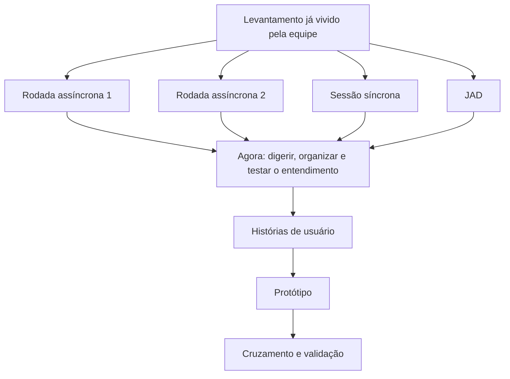

# Orientações Gerais - Atividade 05

> Esta atividade marca a passagem do levantamento para a digestão do que foi descoberto. O objetivo não é escrever frases bonitas: é organizar o entendimento em histórias de usuário capazes de sustentar protótipo e validação.

---

## Onde esta atividade entra no projeto

Para fins didáticos, a equipe chega aqui com quatro frentes de levantamento já acumuladas:

Observação importante:

- as fontes humanas do caso continuam sendo as personas e os artefatos produzidos pela equipe
- aqui, porém, o foco não é voltar a perguntar tudo de novo
- o foco agora é transformar o que já foi levantado em material útil para continuar o projeto

---

## Objetivo didático

Esta etapa existe para verificar se a equipe consegue:

- transformar respostas, contradições e regras em narrativa funcional
- separar o que foi realmente levantado do que ainda é hipótese
- produzir uma história que outra pessoa consiga ler e usar
- usar o protótipo como teste de entendimento, e não como desenho decorativo

Em termos didáticos, a atividade trabalha a passagem de "temos muitas informações" para "temos entendimento organizável".

---

## Por que começar por histórias de usuário

A história de usuário é um modo curto e funcional de organizar um fluxo importante do sistema.

Ela ajuda a responder:

- quem precisa de algo
- o que essa pessoa precisa fazer
- por que isso tem valor
- que regra ou restrição não pode ser esquecida

Nesta disciplina, a história de usuário não substitui o levantamento.

Ela organiza o levantamento.

---

## Breve contexto: o que é uma história de usuário

Uma história de usuário é uma forma enxuta de registrar uma necessidade funcional.

Formato mais comum:

- `Como [perfil]`
- `Quero [objetivo]`
- `Para [valor]`

Mas a história não é só a frase.

Ela precisa carregar, de forma implícita ou explícita:

- o fluxo principal
- a regra relevante
- o cuidado importante
- a conversa que a sustenta

Uma história curta pode ser boa.

Uma história curta e vaga continua sendo ruim.

---

## Por que isso ajuda a prototipar

Antes de desenhar tela, a equipe precisa ordenar o que entendeu.

Se a história estiver boa:

- o colega consegue imaginar o fluxo
- o protótipo mostra campos, ações e estados coerentes
- a validação revela se algo ficou faltando

Se a história estiver ruim:

- o protótipo vira chute
- cada colega imagina um sistema diferente
- a equipe acha que está alinhada, mas não está

---

## Papel do protótipo nesta atividade

O protótipo aqui não serve para:

- ficar bonito
- parecer sistema pronto
- antecipar implementação detalhada

O protótipo aqui serve para:

- tornar o fluxo visível
- expor campos, ações e mensagens necessárias
- revelar lacunas da história
- testar se o entendimento passa de uma pessoa para outra

Baixa ou média fidelidade são suficientes.

Regra prática:

- tudo vale, desde que a dupla consiga comunicar o fluxo com clareza
- o mais importante não é a ferramenta; é a clareza do que está sendo representado

### Opções manuais

Estas opções funcionam muito bem quando a equipe quer pensar rápido, testar ideias e revisar sem apego ao acabamento.

- papel e caneta: bom para rascunho rápido de telas, fluxos e estados
- post-its e folhas soltas: bons para reorganizar etapas do fluxo e testar variações
- quadro ou lousa: bom para discussão em dupla ou com o professor, especialmente quando o fluxo ainda está sendo descoberto

### Softwares de desenho e esquematização

Estas opções são boas quando a equipe quer representar telas e fluxos de forma simples, sem entrar ainda em prototipação mais interativa.

- **Excalidraw**
  Ferramenta online com aparência de quadro desenhado à mão. Muito boa para fluxos, esboços de tela e conversa rápida em dupla.
  Link: https://excalidraw.com

- **diagrams.net (draw.io)**
  Ferramenta online gratuita para diagramas, fluxos e esquemas visuais. Boa para quem prefere organizar a tela de forma mais geométrica e limpa.
  Link: https://app.diagrams.net

### Softwares específicos de prototipação

Estas opções são mais adequadas quando a equipe quer montar telas com mais organização, componentes e navegação entre quadros.

- **Figma**
  Ferramenta bastante usada para interface e prototipação. Permite montar telas, organizar componentes e criar navegação entre frames.
  Link: https://www.figma.com

- **Penpot**
  Ferramenta aberta e voltada a design e prototipação. É uma boa alternativa para quem quer trabalhar com interface e fluxo em ambiente mais próximo de design de produto.
  Link: https://penpot.app

### Fechamento desta escolha

Se a dupla conseguir mostrar com clareza:

- quem faz a ação
- o que aparece na tela
- que decisão o sistema precisa tomar
- que resultado deve acontecer

então a ferramenta escolhida já está servindo ao objetivo da atividade.

---

## Formato de trabalho em pares

Cada dupla deve trabalhar com duas histórias.

Na primeira história:

- integrante A atua como autor principal da história
- integrante B atua como apoio crítico

Na segunda história:

- integrante B atua como autor principal da história
- integrante A atua como apoio crítico

Depois disso, acontece a troca:

- A prototipa a história escrita por B
- B prototipa a história escrita por A

Essa troca é obrigatória porque ela funciona como teste de transferência de entendimento.

---

## Regra didática central

O aluno não deve prototipar a própria história como primeira passada.

Ele deve escrever a história de usuário e passar essa história ao colega.

O colega lê, interpreta, prototipa e depois os dois cruzam:

- o que estava claro
- o que foi entendido de modo diferente
- o que a história não sustentava bem
- o que precisou ser corrigido

---

## O que esta atividade não deve virar

- cópia decorativa do formato `Como / Quero / Para`
- tentativa de resumir o sistema inteiro em uma história
- tela feita por intuição sem lastro no levantamento
- atividade em que um colega pensa e o outro apenas acompanha
- preparação apressada do documento final sem testar entendimento

---

## Em resumo

O que se busca aqui é simples de dizer, mas difícil de fazer bem:

- pegar o que foi levantado
- ordenar esse material
- escrever uma história útil
- entregar essa história a outra pessoa
- verificar se ela consegue representar o mesmo entendimento

Quando isso acontece, a equipe começa a mostrar que está pronta para produzir artefatos mais estáveis depois.

