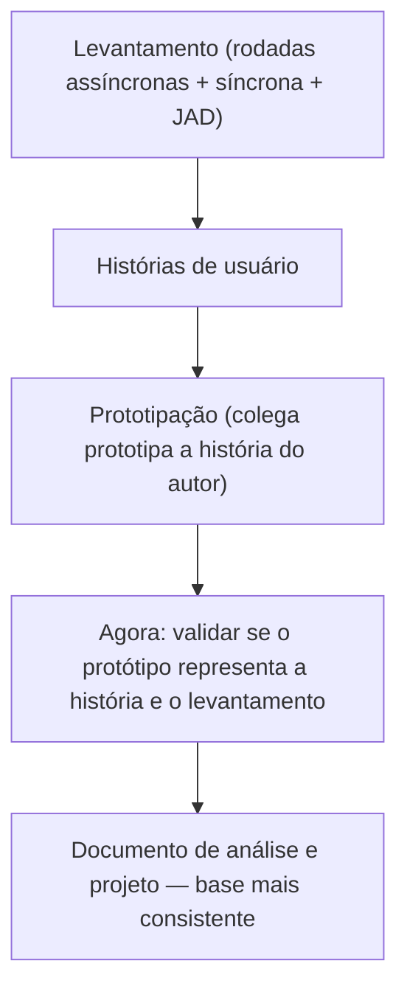

# Validação de Prototipações

> Esta etapa marca a verificação do que foi construído. O objetivo não é aprovar telas bonitas: é confirmar se o protótipo representa corretamente o que foi levantado e formalizado na história de usuário.

---

## Onde esta atividade entra no projeto

A prototipação foi feita com a história do colega como entrada.

A validação agora responde: o que foi construído está correto?

---

## O que significa validar um protótipo aqui

Validar não é:

- dizer que a tela ficou bonita
- aprovar o acabamento visual
- confirmar que o protótipo "parece um sistema"

Validar é:

- percorrer cada cenário da história e verificar se o protótipo o representa
- identificar o que está correto, o que está ausente e o que está errado
- registrar o que precisa ser ajustado — na história, no protótipo, ou nos dois

---

## Duas dimensões de validação

### 1. Protótipo ↔ História de usuário

O protótipo representa o que a história descreveu?

- o fluxo principal está visível?
- a regra relevante aparece na tela?
- o bloqueio ou erro está representado?
- os campos e as ações fazem sentido para o objetivo da história?

### 2. Protótipo ↔ Levantamento

O protótipo é coerente com o que foi descoberto no levantamento?

- os campos e regras batem com o que as personas disseram?
- algum detalhe do levantamento foi ignorado na história e, por consequência, sumiu do protótipo?
- o protótipo introduz algo que não tem base no levantamento?

Se a história estava boa mas o levantamento tinha uma regra que não entrou nela, o problema está na história — não no protótipo.

---

## O que uma boa validação produz

Uma validação bem feita deixa claro:

- o que no protótipo está alinhado com a história e com o levantamento
- o que está ausente ou foi mal representado
- o que precisa ser corrigido — e onde: na história, no protótipo, ou no entendimento da equipe
- o que ainda está em aberto e precisaria de mais levantamento para ser respondido

---

## O que uma validação não deve virar

- lista de melhorias visuais sem relação com os requisitos
- aprovação genérica sem percorrer os cenários
- exercício de opinião sobre o layout
- repetição do que já está na história sem verificar se o protótipo de fato representa isso

---

## Como os critérios de aceite se conectam à validação

Os critérios de aceite escritos na atividade anterior (Dado / Quando / Então) são o instrumento principal da validação.

Cada cenário descreve:

- um contexto (Dado)
- uma ação do usuário (Quando)
- um resultado esperado do sistema (Então)

Validar o protótipo significa percorrer esses cenários na tela e verificar se o resultado esperado está representado.

Se o cenário descreve um bloqueio e o protótipo não mostra nenhuma mensagem de impedimento — a validação falhou nesse ponto.

Se o cenário descreve um fluxo alternativo e o protótipo só mostra o caminho feliz — a validação falhou nesse ponto.

---

## Em resumo

O protótipo é um artefato de entendimento, não de apresentação.

Validá-lo é verificar se o entendimento que ele representa está correto.

Quando a validação encontra um problema, isso não é fracasso. É exatamente o que ela deve fazer.

O problema real seria não encontrar nada — e descobrir a falha depois, quando o custo de corrigir for muito maior.
