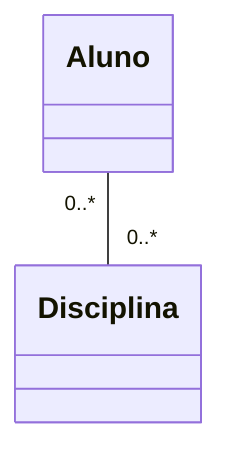
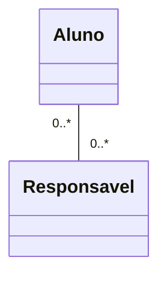
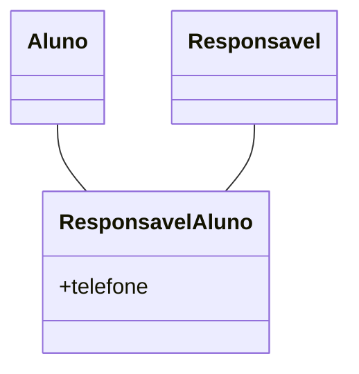
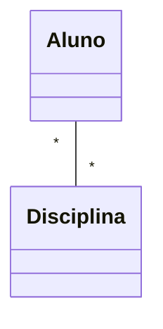
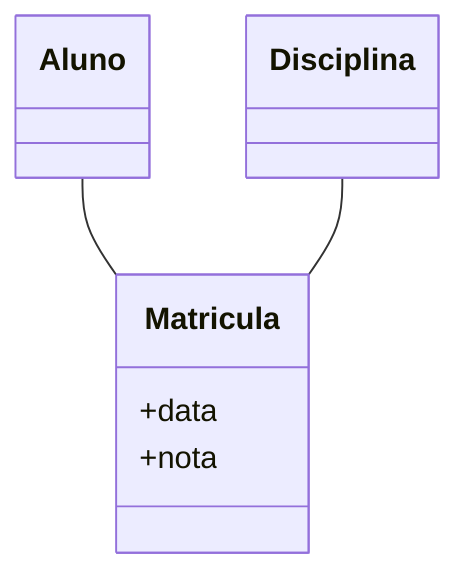
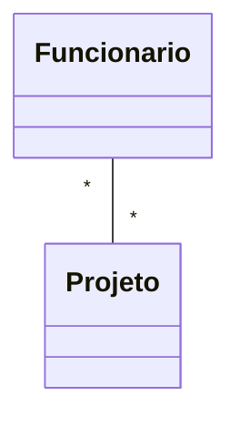
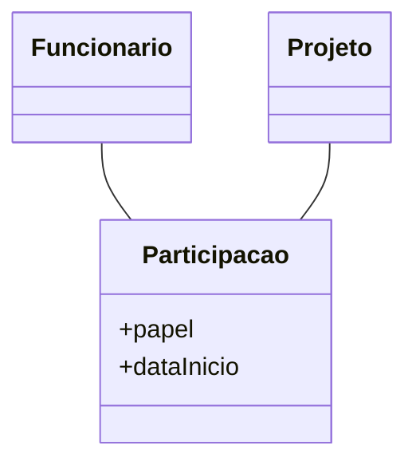

# Associação de Classes na UML: Muitos-para-Muitos

---

## 1. O que é uma Associação Muitos-para-Muitos?

Na UML, uma associação muitos-para-muitos (N:N) indica que:
- Uma instância da classe A pode estar associada a várias instâncias da classe B
- E vice-versa

> **Exemplo:** Um aluno pode cursar várias disciplinas e uma disciplina pode ter vários alunos.

---

## 2. Representação Direta de Muitos-para-Muitos na UML

Na UML, é permitido representar uma associação N:N diretamente, apenas usando as multiplicidades:

- **Correto:** Quando o relacionamento não possui atributos próprios, pode-se usar a associação direta.
- **Exemplo de contexto:**
  - Aluno e Disciplina, se só queremos saber "quem está em qual disciplina".

---

## 3. Quando NÃO pode usar associação N:N direta?

Se o relacionamento entre as classes **possui atributos próprios** (ex: data de matrícula, nota, status), NÃO se deve usar apenas a associação direta.

### **Errado:**

- **Problema:** Não há como registrar atributos do relacionamento (ex: telefone).

### **Correto:** Use uma Association Class (Classe de Associação)

- **Explicação:** A classe `ResponsavelAluno` representa o relacionamento e armazena os atributos próprios da associação.

---

## 4. Exemplos 

### Exemplo 1: Aluno e Disciplina (sem atributos na associação)

**Correto:**

- **Quando usar:** Quando só interessa saber "quem está em qual disciplina".

### Exemplo 2: Aluno e Disciplina (com atributos na associação)

**Correto:**

- **Quando usar:** Quando é necessário registrar informações como data de matrícula, nota, frequência, etc.

### Exemplo 3: Funcionário e Projeto

- Um funcionário pode participar de vários projetos e um projeto pode ter vários funcionários.
- Se não há atributos no relacionamento:

- Se há atributos (ex: papel do funcionário no projeto):

---

## 5. Resumo: Quando usar cada abordagem?

| Situação                                      | Como modelar na UML?                |
|-----------------------------------------------|-------------------------------------|
| Relacionamento N:N **sem atributos próprios** | Associação direta com multiplicidade |
| Relacionamento N:N **com atributos próprios** | Association class (classe de associação) |

---

## 6. Erros Comuns

- **Erro:** Usar associação direta N:N quando precisa registrar dados do relacionamento.
- **Erro:** Criar uma classe intermediária sem necessidade, quando o relacionamento não tem atributos.
- **Erro:** Não indicar multiplicidade corretamente.

---

## 7. Dica Visual

> Sempre pergunte: "Preciso guardar informações sobre o relacionamento?" Se sim, use uma association class. Se não, use associação direta.

---

## 8. Materiais de Estudo

### Principal

1. **LARMAN, Craig. Utilizando UML e padrões. 3. ed. Bookman, 2005.**
   - Capítulo 6: Modelagem de Classes (p. 95-135)
   - O que estudar: Associações, multiplicidades, classes de associação.

2. **BEZERRA, Eduardo. Princípios de análise e projeto de sistemas com UML. 2. ed. Campus, 2007.**
   - Capítulo 3: Modelagem de Classes e Objetos (p. 67-110)
   - O que estudar: Exemplos de associações e classes de associação.

### Complementar

- **Engenharia de Software Moderna**
  - Capítulo 3: Requisitos
  - Disponível em: [https://engsoftmoderna.info/cap3.html](https://engsoftmoderna.info/cap3.html)
  - O que estudar: Exemplos de associações e dicas de modelagem.

- **Princípios de Análise e Projeto de Sistemas com UML - Eduardo Bezerra**
  - Capítulo 5: Modelagem de Classes de Análise
  - Disponível em: [PDF Tecgraf PUC-Rio](https://www.tecgraf.puc-rio.br/ftp_pub/lfm/EduardoBezerra-PrincipiosAnaliseProjetoSistemasComUML-2aEd.pdf)
  - O que estudar: Exemplos visuais de associações e classes de associação.

--- 