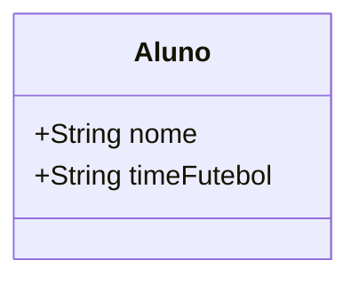
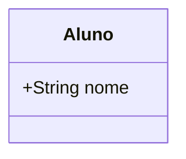
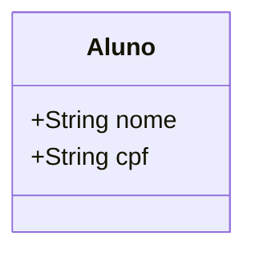
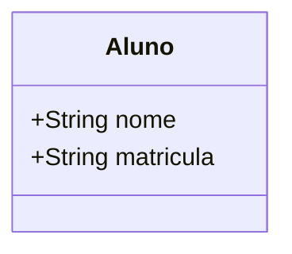
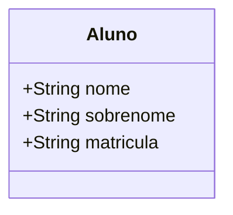
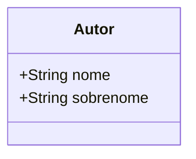
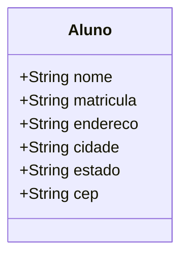

# Abstração em Modelagem de Classes: O que Realmente Importa?

---

## 1. O que é Abstração?

Abstração é o princípio de **modelar apenas o que é relevante** para o domínio do sistema, ignorando detalhes desnecessários. O objetivo é simplificar o modelo, tornando-o mais compreensível, flexível e fácil de manter.

> **Dica:** Pergunte sempre: "Esse atributo ou método é realmente necessário para o objetivo do sistema?"

---

## 2. Exemplos Exagerados: O que NÃO faz sentido

### Exemplo 1: Classe Aluno com atributo irrelevante

**Errado:**

- **Problema:** O atributo `timeFutebol` não é relevante para um sistema de gestão acadêmica.

**Certo:**

- **Explicação:** Só inclua atributos que realmente importam para o domínio do sistema.

---

## 3. Refinando a Abstração: O que pode ser desnecessário

### Exemplo 2: Classe Aluno com atributo CPF em sistema de notas

**Errado:**

- **Problema:** Para um sistema de gestão de notas, o CPF pode ser desnecessário. O atributo matrícula já é suficiente para identificar o aluno.

**Certo:**

- **Explicação:** Use apenas os atributos essenciais para o contexto do sistema.

---

## 4. Abstração em Nomes: Nome e Sobrenome

### Exemplo 3: Nome e Sobrenome em Aluno

**Errado:**

- **Problema:** Para a maioria dos sistemas acadêmicos, nome completo é suficiente. Separar nome e sobrenome pode ser desnecessário e até confuso.

**Certo:**

- **Explicação:** Use um único atributo `nome` para simplificar.

### Exceção: Autor em Sistema de Referências

**Correto:**

- **Explicação:** Em sistemas de referência bibliográfica, separar nome e sobrenome faz sentido para formatação de citações.

---

## 5. Outros Exemplos Contextualizados

### Exemplo 4: Endereço Completo em Sistema de Notas

**Errado:**

- **Problema:** Para um sistema de notas, endereço completo é irrelevante.

**Certo:**

- **Explicação:** Endereço só deve ser incluído se for necessário para o domínio (ex: sistema de correspondência).

---

## 6. Resumo: O que pode e o que não pode

| Contexto do Sistema         | Atributo Relevante? | Por quê?                                      |
|----------------------------|---------------------|-----------------------------------------------|
| Gestão de Notas            | CPF                 | Não (matrícula já identifica)                 |
| Gestão de Notas            | Endereço            | Não (não é usado para notas)                  |
| Sistema de Referências     | Nome/Sobrenome      | Sim (para formatação de citações)             |
| Sistema de Correspondência | Endereço            | Sim (para envio de cartas)                    |
| Sistema Acadêmico Geral    | Time de Futebol     | Não (irrelevante para o domínio)              |

---

## 7. Dicas para Abstração

- Sempre questione a real necessidade de cada atributo ou método.
- Evite modelar detalhes que não serão usados pelo sistema.
- Adapte o nível de detalhe ao contexto e objetivo do sistema.
- Lembre-se: **menos é mais** na modelagem!

---

## 8. Materiais de Estudo

### Principal

1. **LARMAN, Craig. Utilizando UML e padrões. 3. ed. Bookman, 2005.**
   - Capítulo 6: Modelagem de Classes (p. 95-135)
   - O que estudar: Princípios de abstração, exemplos de atributos relevantes.

2. **BEZERRA, Eduardo. Princípios de análise e projeto de sistemas com UML. 2. ed. Campus, 2007.**
   - Capítulo 3: Modelagem de Classes e Objetos (p. 67-110)
   - O que estudar: Exemplos de abstração e simplificação de modelos.

### Complementar

- **Engenharia de Software Moderna**
  - Capítulo 3: Requisitos
  - Disponível em: [https://engsoftmoderna.info/cap3.html](https://engsoftmoderna.info/cap3.html)
  - O que estudar: Exemplos de abstração e dicas de modelagem.

- **Princípios de Análise e Projeto de Sistemas com UML - Eduardo Bezerra**
  - Capítulo 5: Modelagem de Classes de Análise
  - Disponível em: [PDF Tecgraf PUC-Rio](https://www.tecgraf.puc-rio.br/ftp_pub/lfm/EduardoBezerra-PrincipiosAnaliseProjetoSistemasComUML-2aEd.pdf)
  - O que estudar: Exemplos visuais de abstração e modelagem enxuta.

--- 