# Coesão e Acoplamento: Clareza e Manutenção em Modelagem de Classes

---

## 1. O que são Coesão e Acoplamento?

- **Coesão:** Mede o quão bem os elementos de uma classe (atributos e métodos) estão relacionados entre si. Alta coesão significa que a classe tem uma responsabilidade clara e única.
- **Acoplamento:** Mede o grau de dependência entre diferentes classes. Baixo acoplamento é desejável, pois facilita a manutenção e evolução do sistema.

> **Resumo:** Coesão ajuda a manter as classes claras e focadas. Acoplamento excessivo "amarra" o sistema, tornando-o difícil de manter e evoluir.

---

## 2. Diferença e Relação

- **Coesão** é interna à classe: quanto mais os métodos e atributos têm a ver uns com os outros, melhor.
- **Acoplamento** é externo: quanto menos uma classe depende de outras para funcionar, melhor.
- **Ligação:** Classes coesas tendem a ter menos acoplamento, pois não "invadem" responsabilidades de outras.

---

## 3. Exemplos Exagerados: O que NÃO fazer

### Exemplo 1: Baixa Coesão e Alto Acoplamento

**Errado:**
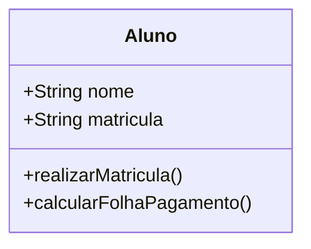
- **Problema:** Métodos como `calcularFolhaPagamento()` não têm nada a ver com a responsabilidade de um Aluno. `realizarMatricula()` também pode ser responsabilidade de outro componente (ex: sistema de matrícula).

**Certo:**
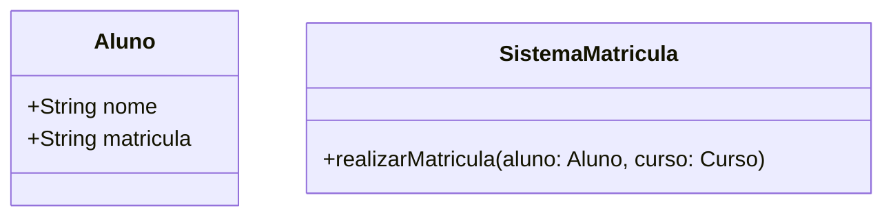
- **Explicação:** Cada classe tem métodos coerentes com sua responsabilidade. O sistema de matrícula realiza a matrícula, não o aluno.

---

## 4. Coesão: Métodos Certos nas Classes Certas

### Exemplo 2: Métodos Incoerentes

**Errado:**
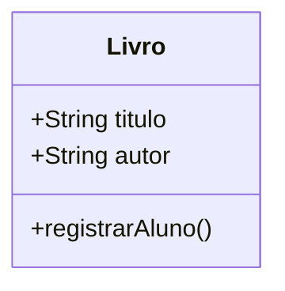
- **Problema:** `registrarAluno()` não faz sentido em Livro.

**Certo:**
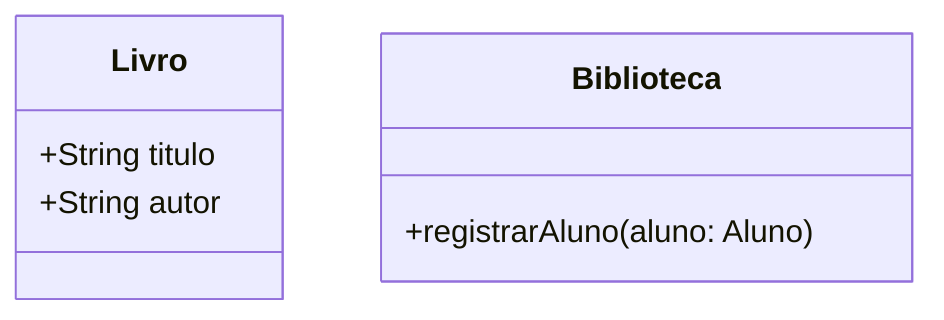
- **Explicação:** O método está na classe responsável pela ação.

---

## 5. Acoplamento: Quando uma Classe Depende Demais de Outra

### Exemplo 3: Alto Acoplamento

**Errado:**
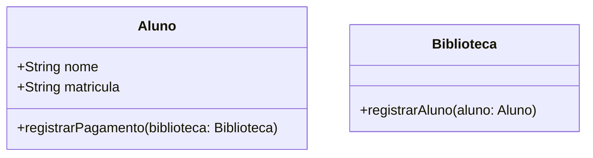
- **Problema:** O aluno depende diretamente da biblioteca para registrar pagamentos, criando dependência desnecessária.

**Certo:**
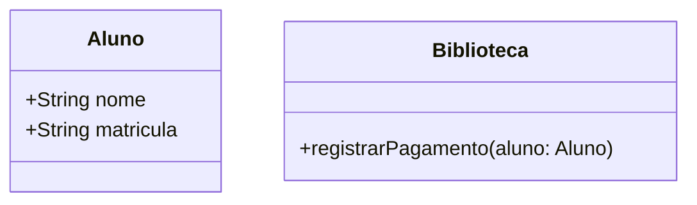
- **Explicação:** A biblioteca gerencia pagamentos, mantendo baixo acoplamento.

---

## 6. Resumo Visual

| Situação                        | Coesão         | Acoplamento     | Correto? |
|---------------------------------|----------------|-----------------|----------|
| Classe com métodos desconexos   | Baixa          | -               | Não      |
| Classe depende de muitas outras | -              | Alta            | Não      |
| Classe com métodos coerentes    | Alta           | Baixo           | Sim      |

---

## 7. Dicas Práticas

- Mantenha cada classe focada em uma responsabilidade.
- Evite que uma classe "faça tudo" ou dependa de muitas outras.
- Prefira métodos que usem apenas atributos da própria classe.
- Se precisar de outra classe, use parâmetros ou serviços, não dependências diretas.

---

## 8. Materiais de Estudo

### Principal

1. **LARMAN, Craig. Utilizando UML e padrões. 3. ed. Bookman, 2005.**
   - Capítulo 6: Modelagem de Classes (p. 95-135)
   - Capítulo 9: Padrões de Projeto e Antipadrões (p. 210-250)
   - O que estudar: Princípios de coesão e acoplamento, exemplos de boas práticas.

2. **BEZERRA, Eduardo. Princípios de análise e projeto de sistemas com UML. 2. ed. Campus, 2007.**
   - Capítulo 3: Modelagem de Classes e Objetos (p. 67-110)
   - O que estudar: Exemplos de coesão, acoplamento e responsabilidades de classes.

### Complementar

- **Engenharia de Software Moderna**
  - Capítulo 3: Requisitos
  - Disponível em: [https://engsoftmoderna.info/cap3.html](https://engsoftmoderna.info/cap3.html)
  - O que estudar: Exemplos de coesão, acoplamento e dicas de modelagem.

- **Princípios de Análise e Projeto de Sistemas com UML - Eduardo Bezerra**
  - Capítulo 5: Modelagem de Classes de Análise
  - Disponível em: [PDF Tecgraf PUC-Rio](https://www.tecgraf.puc-rio.br/ftp_pub/lfm/EduardoBezerra-PrincipiosAnaliseProjetoSistemasComUML-2aEd.pdf)
  - O que estudar: Exemplos visuais de coesão e acoplamento.

---

## 5. Exemplos Comuns de Confusão de Iniciantes

### Exemplo 4: Aluno com método verNota

**Errado:**
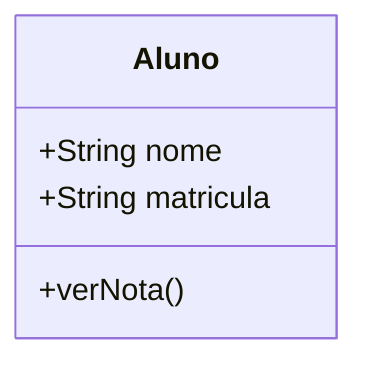
- **Problema:** O método `verNota()` sugere que o aluno "possui" as notas, mas normalmente as notas pertencem ao contexto de uma avaliação, disciplina ou sistema acadêmico.

**Certo:**
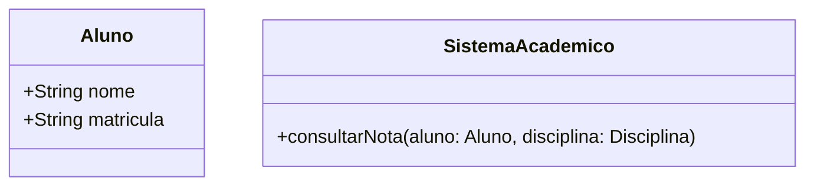
- **Explicação:** O sistema acadêmico ou módulo de avaliação é responsável por fornecer as notas, não o aluno diretamente.

---

### Exemplo 5: Professor com lista de Disciplinas

**Errado:**
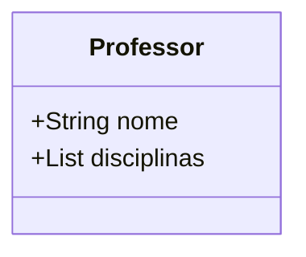
- **Problema:** O professor não "possui" as disciplinas. O relacionamento deve ser modelado por associação, não por atributo direto.

**Certo:**
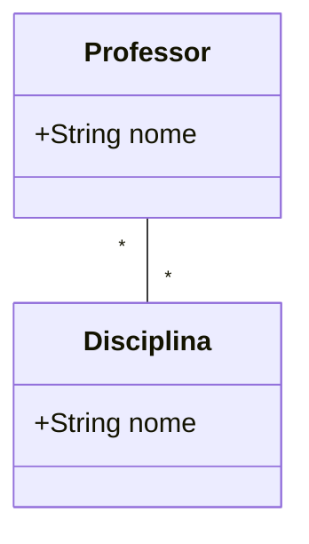
- **Explicação:** O relacionamento muitos-para-muitos é representado por associação, não por um atributo de lista.

---

### Exemplo 6: Disciplina com referência direta a Curso

**Errado:**
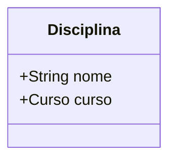
- **Problema:** A disciplina não "possui" o curso, mas está associada a ele. O relacionamento deve ser feito por associação.

**Certo:**
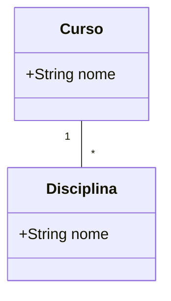
- **Explicação:** O curso agrega várias disciplinas, mas a disciplina não precisa ter um atributo direto para o curso.

---

### Exemplo 7: Biblioteca com método emprestarLivro diretamente ao Aluno

**Errado:**
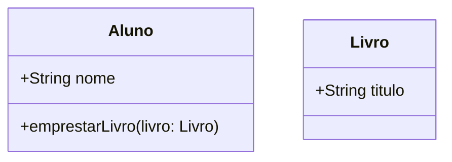
- **Problema:** O aluno não é responsável por emprestar livros; a biblioteca é.

**Certo:**
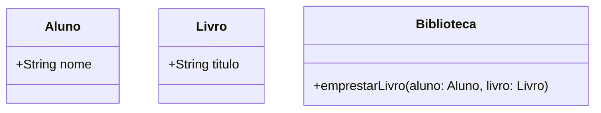
- **Explicação:** A biblioteca gerencia o empréstimo, mantendo alta coesão e baixo acoplamento.

--- 