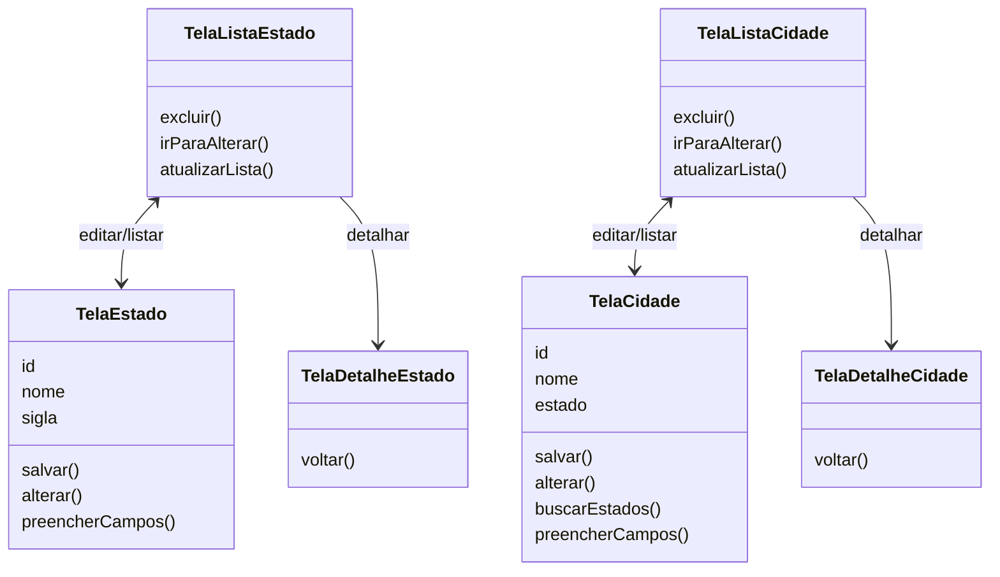

# Telas e fluxo para persistência

## Pergunta de retomada

O que precisamos para persistência?

```text
Persistência
|
+-- conexão → biblioteca
+-- model
+-- DAO → SQL
+-- telas que enviam e recebem dados
```

Este arquivo foca no que precisa em relação a widgets: entender o fluxo necessário para cadastrar, listar, detalhar, alterar e excluir dados.

## Diagrama das telas



## Fluxo: abrir cadastro de cidade
Precisa ter estados no campo de opções.

Usar `DropdownButton`:

→ mostrar nome e retornar **objeto Estado**.

```dart
final estados = await estadoDao.buscarTodos();

DropdownButton<Estado>(
  value: estadoSelecionado, // precisa estar em um StatefulWidget
  items: estados.map((estado) { // percorre a lista
    return DropdownMenuItem<Estado>( // cria uma opção para cada estado
      value: estado, // objeto que será selecionado
      child: Text(estado.nome), // texto mostrado na tela
    );
  }).toList(),
  onChanged: (estado) {
    setState(() {
      estadoSelecionado = estado; // objeto Estado escolhido
    });
  },
);

/*
Ideia importante:
- Mostra na tela: estado.nome
- Guarda no código: objeto Estado
*/
```
## Fluxo: salvar cidade
`TelaCidade.salvar()` → `TelaListaCidade.atualizarLista()`

Ideia:
* a tela de cadastro salva
* a lista precisa ser atualizada
* o detalhe mostra um registro específico
* a edição volta para a tela de cadastro com dados preenchidos

```dart
//em TelaListaCidade
Future<void> buscarCidades() async {
  final resultado = await dao.buscarTodos();
  setState(() {
    cidades = resultado;
  });
}
```
## Fluxo: editar cidade
TelaListaCidade - usuário clica em **editar** de uma lista

Precisamos enviar o objeto cidade para `TelaCidade`.

```dart
// Na TelaListaCidade
Navigator.pushNamed(
  context,
  Rota.cidadeForm, // rota do formulário
  arguments: cidade, // envio do objeto a ser editado
).then((value) => buscarCidades());

// arguments: cidade -> envia cidade
// then(...) -> quando voltar, busca as cidades novamente
```

`TelaCidade` recebe cidade:

```dart
// Na TelaCidade
var parametro = ModalRoute.of(context);
if (parametro != null && parametro.settings.arguments != null) {
  Cidade cidade = parametro.settings.arguments as Cidade;
  id = cidade.id;
  preencherCampos(cidade);
}

// sem cidade -> cadastrar
// com cidade -> alterar
```
* o sistema preenche os campos (preencherCampos), 
* usuário confirma alteração 
* o sistema salva e volta para a lista atualizada

## Perguntas rápidas

* Qual tela cadastra cidade?
* Qual tela lista cidades?
* Por que a tela de cidade precisa buscar estados?
* O que o `DropdownButton` mostra?
* O que o `DropdownButton` guarda?
* Por que a lista precisa atualizar depois de editar?
* Por que usamos `StatefulWidget` nesse fluxo?

## Ligação com o próximo assunto

Agora sabemos quais telas participam do fluxo.

O próximo passo é imaginar o pior caso didático: todo o código de persistência dentro das telas.

Isso ajuda a perceber o que começa a repetir.
