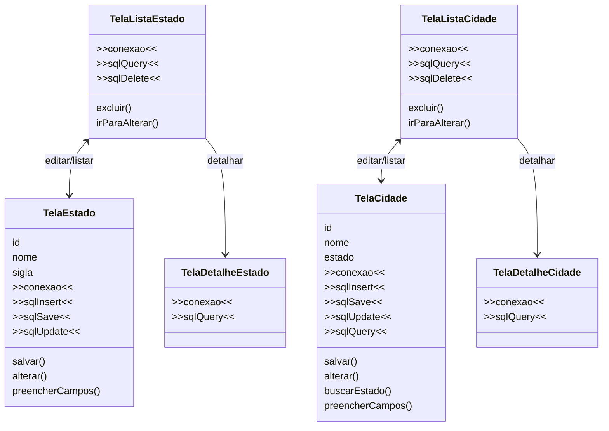

# Código de persistência nas telas

## Pergunta de retomada

O que precisamos para persistência?

```text
Persistência
|
+-- conexão com o banco
+-- SQL para criar/manipular dados
+-- model
+-- telas que enviam e recebem dados
+-- organização para não repetir código
```

Este arquivo mostra o que aconteceria se cada tela cuidasse diretamente da persistência.

A repetição é proposital.

O objetivo é perceber o problema antes de organizar o código.

## Diagrama das telas com persistência direta



## O que aparece em várias telas?

```text
conexao
sqlQuery
sqlInsert
sqlUpdate
sqlDelete
salvar()
alterar()
excluir()
```

Quando a persistência fica dentro das telas, cada tela começa a saber demais.

Ela passa a cuidar de:

* campos da interface
* navegação
* estado visual
* conexão com o banco
* comandos SQL
* conversão de dados
* atualização da lista

## Onde repete?

```text
TelaEstado
|
+-- conexão
+-- SQL de inserir
+-- SQL de alterar

TelaCidade
|
+-- conexão
+-- SQL de inserir
+-- SQL de alterar

TelaListaEstado
|
+-- conexão
+-- SQL de consultar
+-- SQL de excluir

TelaListaCidade
|
+-- conexão
+-- SQL de consultar
+-- SQL de excluir
```

## Quando repete?

Repete sempre que uma nova entidade aparece.

Exemplos:

* Estado
* Cidade
* Cliente
* Produto
* Categoria

Se cada cadastro tiver sua própria tela com conexão e SQL, o projeto cresce com muita repetição.

## Problema principal

```text
Tela + SQL + conexão + regra de persistência
= código acoplado e repetido
```

Isso dificulta:

* manutenção
* correção de erros
* reaproveitamento
* teste
* alteração do banco
* entendimento do projeto

## O que podemos fazer?

Separar responsabilidades.

```text
Tela
|
+-- cuida da interface
+-- envia e recebe models

DAO
|
+-- cuida do SQL
+-- acessa o banco

Conexão
|
+-- abre e controla o banco
```

Ideia:

```text
Tela -> DAO -> Conexão -> Banco
```

## Perguntas de reflexão

* O que repete no diagrama?
* Onde essa repetição aparece?
* Quando essa repetição aumenta?
* A tela deveria conhecer SQL?
* A tela deveria abrir conexão com o banco?
* O que podemos separar em outra classe?
* Que problema o DAO começa a resolver?

## Ligação com o próximo assunto

O primeiro problema visível é a conexão repetida.

Por isso, o próximo arquivo centraliza a abertura e criação do banco em uma classe própria.
