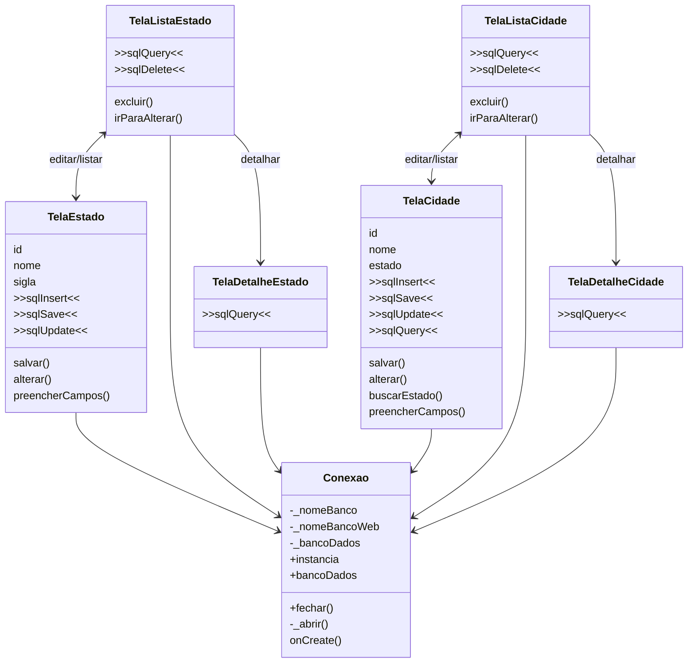

# Código com classe de conexão

## Pergunta de retomada

No arquivo anterior, o que repetia em várias telas?

```text
>>conexao<<
>>sqlInsert<<
>>sqlUpdate<<
>>sqlQuery<<
>>sqlDelete<<
```

Agora vamos retirar a conexão das telas.

A conexão passa a ficar em uma classe própria.

## Diagrama com classe de conexão



## Classe de conexão usada como referência

A classe de conexão centraliza o que antes aparecia em várias telas:

```text
Conexao
|
+-- instancia
+-- bancoDados
+-- _abrir()
+-- onCreate()
+-- fechar()
```

## O que esta classe centraliza?

```text
nome do banco
caminho do banco
abertura da conexão
versão do banco
criação das tabelas
dados iniciais
fechamento da conexão
```

## O que ainda ficou nas telas?

```text
>>sqlInsert<<
>>sqlUpdate<<
>>sqlQuery<<
>>sqlDelete<<
```

Centralizar a conexão melhora o projeto, mas não resolve tudo.

```text
Tela + SQL
= ainda existe acoplamento
```

O próximo passo é retirar o SQL das telas.

## Perguntas de reflexão

* O que melhorou ao criar uma classe de conexão?
* O que deixou de repetir?
* O que ainda continua repetido?
* As telas ainda conhecem SQL?
* Se mudar o nome de uma tabela, quantas telas podem ser afetadas?
* Qual seria o próximo passo para melhorar a organização?

## Ligação com o próximo assunto

Depois de centralizar a conexão, ainda falta retirar o SQL das telas.

Esse será o papel do DAO.

