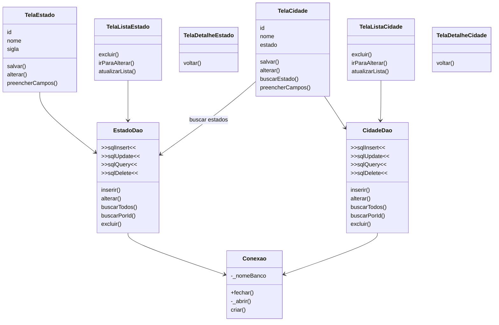

# Código com DAO

## Pergunta de retomada

No arquivo anterior, o que ainda estava espalhado nas telas?

```text
>>sqlInsert<<
>>sqlUpdate<<
>>sqlQuery<<
>>sqlDelete<<
```

A conexão já estava centralizada.

Mas o SQL ainda estava nas telas.

Agora vamos retirar o SQL das telas.

## Ideia principal

DAO significa Data Access Object.

O DAO é uma classe responsável por acessar os dados.

```text
Tela -> DAO -> Conexao -> Banco
```

Com DAO:

* a tela cuida da interface
* o DAO cuida do SQL
* a classe de conexão cuida do banco

## Diagrama com DAO



## O que mudou?

```text
antes: Tela -> SQL -> Conexão -> Banco
agora: Tela -> DAO -> Conexão -> Banco
```

As telas deixam de conhecer os comandos SQL.

## O que saiu das telas?

```text
>>sqlInsert<<
>>sqlUpdate<<
>>sqlQuery<<
>>sqlDelete<<
```

Agora as telas chamam métodos do DAO.

Exemplo:

```text
tela chama: cidadeDao.buscarTodos()
DAO executa: SELECT ...
```

## O que melhorou?

```text
SQL centralizado no DAO
= menos repetição nas telas
= telas mais simples
= manutenção mais fácil
```

Agora existe um lugar principal para cada entidade:

* inserir dados de uma entidade
* consultar dados de uma entidade
* alterar dados de uma entidade
* excluir dados de uma entidade
* ajustar SQL daquela entidade

## Responsabilidades

```text
Tela
|
+-- mostra dados
+-- recebe ações do usuário
+-- chama o DAO

DAO
|
+-- monta ou executa SQL
+-- usa a conexão
+-- devolve dados para a tela

Conexao
|
+-- abre o banco
+-- cria tabelas
+-- controla a conexão
```

## O que ainda precisa de atenção?

O banco retorna dados em formato de tabela ou `Map`.

O app trabalha melhor com models.

Por isso, o DAO também precisa lidar com:

```text
Map -> Model
Model -> Map
```

Esse é o mapeamento objeto-relacional manual. A associação entre cidade e estado será detalhada nos arquivos do DAO com associação.

## Perguntas de reflexão

* O que melhorou ao criar DAOs?
* O que saiu das telas?
* Onde o SQL ficou?
* Por que a tela fica mais simples?
* Se mudar um SQL de cidade, qual classe deve ser alterada?
* Que problema o mapeamento manual começa a resolver?

## Ligação com o próximo assunto

Com o DAO, o SQL saiu das telas.

Agora precisamos organizar melhor os dados que entram e saem do DAO.

Para isso, usamos models.
