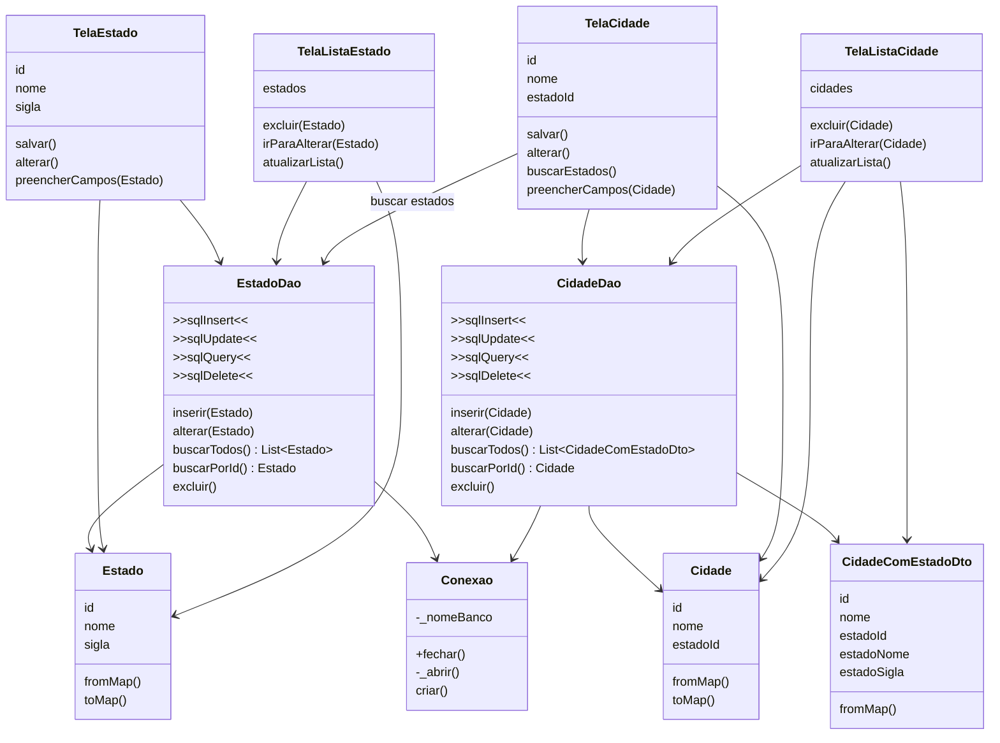

# Código com Model

## Pergunta de retomada

No arquivo anterior, o que melhorou?

```text
Tela -> DAO -> Conexao -> Banco
```

O SQL saiu das telas.

Mas ainda falta deixar claro como os dados circulam pelo app.

Agora vamos inserir os models.

## Organização desejada

Este é o formato que queremos alcançar nesta etapa do projeto.

```text
Tela -> DAO -> Conexao -> Banco
  |
  +-- usa Model
```

Ou seja:

* tela não escreve SQL
* tela não abre banco diretamente
* DAO concentra o acesso aos dados
* conexão centraliza o banco
* model representa os dados do aplicativo

## Ideia principal

Model é a classe que representa uma entidade do sistema.

Exemplos:

```text
Estado
Cidade
```

Em vez de passar dados soltos, o app passa objetos.

```text
Map solto      -> frágil
Model Estado   -> mais claro
Model Cidade   -> mais claro
```

## Diagrama com Model



## O que mudou?

```text
Tela usa Model
DAO recebe/devolve Model ou DTO
Banco armazena dados em tabela
```

## Fluxo com model

```text
TelaCidade
|
+-- cria ou recebe Cidade
    |
    v
CidadeDao
|
+-- transforma Cidade em Map/SQL
    |
    v
Banco
```

Na consulta:

```text
Banco
|
+-- devolve Map
    |
    v
CidadeDao
|
+-- transforma Map em Cidade
    |
    v
TelaCidade ou TelaListaCidade
```

## Por que usar Model?

Model deixa o dado mais claro.

Exemplo:

```text
Estado
|
+-- id
+-- nome
+-- sigla
```

Em vez de depender de chaves soltas:

```text
map['nome']
map['sigla']
```

O código passa a trabalhar com:

```text
estado.nome
estado.sigla
```

## Onde fica a conversão?

No model e/ou no DAO.

Exemplo conceitual:

```text
Estado.fromMap()
Map -> Estado

estado.toMap()
Estado -> Map
```

O importante é não espalhar essa conversão em todas as telas.

## Associação: Cidade e Estado

No banco, `cidade` guarda `estado_id`.

Na interface, a cidade precisa ser exibida junto com nome e sigla do estado.

Por isso, a associação será tratada com consulta e DTO nos arquivos do DAO com associação.

```text
Cidade
|
+-- id
+-- nome
+-- estadoId
```

## Perguntas de reflexão

* O que melhora ao usar Model?
* O que o DAO passa a receber e devolver?
* Por que `Map` espalhado pode ser um problema?
* Onde deve ficar a conversão entre `Map` e Model?
* Por que `Cidade` precisa ter `estadoId`?
* Como o Model ajuda a tela?

## Ligação com o próximo assunto

Com model, DAO e conexão, a persistência já está mais organizada.

Mas a tela ainda pode acumular fluxo, validação e navegação.

Por isso, o próximo passo é olhar para a separação:

```text
Tela -> Controle -> Modelo
```

