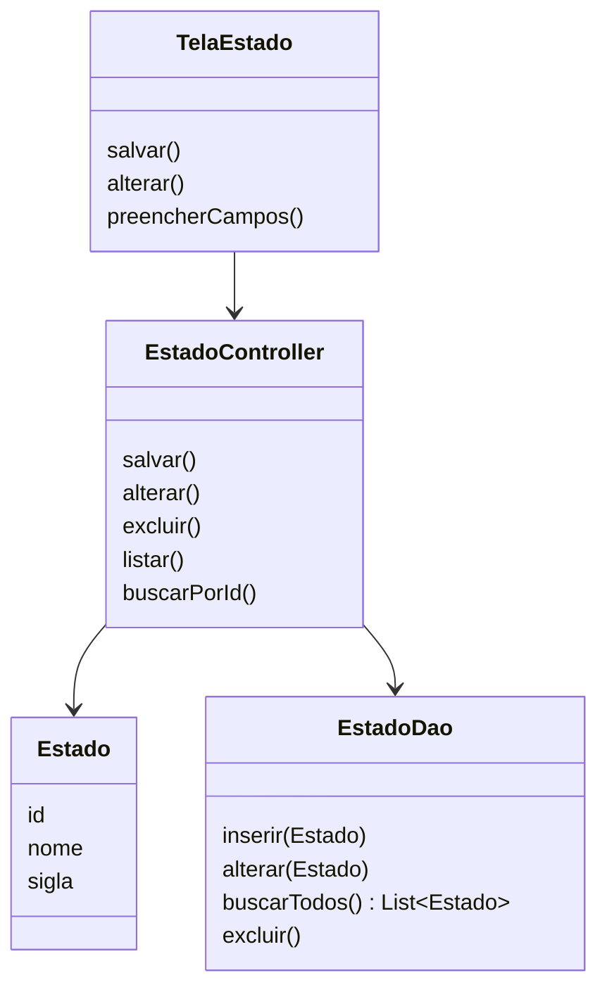

# Interface: Tela, Controle e Modelo

## Pergunta de retomada

No arquivo anterior, chegamos ao formato desejado para persistência:

```text
Tela -> DAO -> Conexao -> Banco
  |
  +-- usa Model
```

Agora vamos olhar para a interface.

Em interfaces, uma organização comum é separar:

```text
Tela -> Controle -> Modelo
```

Essa ideia aparece em discussões de arquitetura de interface, como nas recomendações de Robert C. Martin, o Tio Bob: a tela não deve concentrar todas as decisões do sistema.

## Ideia principal

```text
Tela
|
+-- mostra dados
+-- recebe ações do usuário

Controle
|
+-- coordena o fluxo
+-- chama DAO
+-- atualiza dados da tela

Modelo
|
+-- representa os dados
+-- Estado
+-- Cidade
```

## Por que criar controle?

Sem controle, a tela tende a acumular muita coisa.

Ela pode acabar cuidando de:

* campos visuais
* navegação
* validação
* chamada ao DAO
* atualização de lista
* montagem de models
* tratamento de retorno

Com controle, a tela fica mais focada na interface.

## Diagrama geral



## Aplicando em Estado

```text
TelaEstado
|
+-- lê campos da tela
+-- chama EstadoController.salvar()

EstadoController
|
+-- cria ou recebe Estado
+-- valida o necessário
+-- chama EstadoDao

Estado
|
+-- id
+-- nome
+-- sigla
```

Fluxo:

```text
usuário preenche tela
        |
        v
TelaEstado
        |
        v
EstadoController
        |
        v
EstadoDao
        |
        v
Banco
```

## Aplicando em Cidade

Cidade tem um detalhe a mais.

Ela depende de Estado.

```text
TelaCidade
|
+-- lê nome da cidade
+-- mostra estados no DropdownButton
+-- chama CidadeController.salvar()

CidadeController
|
+-- busca estados
+-- cria ou recebe Cidade
+-- chama CidadeDao

Cidade
|
+-- id
+-- nome
+-- estadoId
```

Fluxo:

```text
TelaCidade
|
+-- buscarEstados()
    |
    v
CidadeController
|
+-- EstadoDao.buscarTodos()
    |
    v
lista de Estado para DropdownButton
```

Fluxo para salvar:

```text
usuário informa nome e escolhe Estado
        |
        v
TelaCidade
        |
        v
CidadeController
        |
        v
CidadeDao
        |
        v
Banco
```

## Comparação simples

| Parte | Responsabilidade |
| ----- | ---------------- |
| Tela | mostrar dados e capturar ações |
| Controle | coordenar o fluxo da interface |
| Modelo | representar os dados |
| DAO | acessar o banco |
| Conexao | abrir e controlar o banco |

## Perguntas de reflexão

* O que a tela deixa de fazer quando existe um controle?
* Qual é a função do controle?
* Qual é a diferença entre controle e DAO?
* Por que CidadeController precisa buscar estados?
* O que o Model representa nesse fluxo?
* Essa divisão deixa o projeto mais simples ou mais complexo? Em que momento ela vale a pena?

## Ligação com o próximo assunto

Depois de entender onde o model aparece na arquitetura, vamos olhar para o código dos models.

O foco será ver como `Estado`, `Cidade` e `CidadeComEstadoDto` representam os dados.
