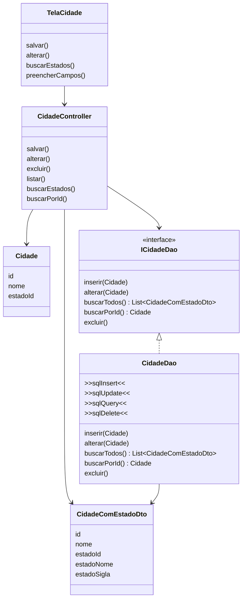

# Interface do DAO no Controller

## Pergunta de retomada

No arquivo anterior, vimos:

```text
Tela -> Controller -> Model
Controller -> DAO
```

O controller coordena o fluxo da interface.

Mas ele ainda pode ficar preso a uma classe DAO concreta.

Agora vamos inserir uma interface para o DAO.

## Ideia principal

Interface é um contrato.

Ela define quais métodos devem existir.

O controller passa a depender do contrato, não diretamente da implementação.

```text
Controller -> Interface do DAO -> DAO concreto -> Conexao -> Banco
```

## Diagrama geral



## O que mudou?

Antes:

```text
CidadeController -> CidadeDao
```

Agora:

```text
CidadeController -> ICidadeDao
ICidadeDao <- CidadeDao
```

O controller conhece a interface.

O DAO concreto implementa a interface.

## O que a interface define?

Exemplo conceitual:

```text
ICidadeDao
|
+-- inserir(Cidade)
+-- alterar(Cidade)
+-- buscarTodos()
+-- buscarPorId()
+-- excluir()
```

A interface não diz como o SQL será feito.

Ela apenas define o que o DAO precisa oferecer.

## Por que isso ajuda?

Porque o controller deixa de depender diretamente de uma implementação específica.

Isso facilita:

* trocar o DAO concreto
* testar o controller
* isolar a biblioteca de banco
* reduzir acoplamento
* organizar melhor o projeto

## Exemplo simples

```text
CidadeController
|
+-- precisa salvar cidade
    |
    v
ICidadeDao
|
+-- garante que existe inserir(Cidade)
    |
    v
CidadeDao
|
+-- executa SQL no banco
```

## Diferença entre interface e DAO

| Parte | Responsabilidade |
| ----- | ---------------- |
| Interface do DAO | define o contrato |
| DAO concreto | implementa o contrato e executa SQL |
| Controller | usa o contrato para coordenar a tela |

## Relação com inversão de dependência

Sem interface:

```text
Controller depende de CidadeDao concreto
```

Com interface:

```text
Controller depende de ICidadeDao
CidadeDao depende do contrato definido por ICidadeDao
```

O controller fica menos preso aos detalhes do banco.

## Perguntas de reflexão

* O que a interface do DAO define?
* O controller deve depender do DAO concreto ou do contrato?
* O que melhora ao usar uma interface?
* A interface executa SQL?
* Quem executa SQL de verdade?
* Por que isso ajuda a trocar ou testar partes do código?

## Ligação com o próximo assunto

Até aqui, a ideia foi conceitual.

A partir do próximo arquivo, entramos no código completo das partes principais.

Primeiro: a classe de conexão.
